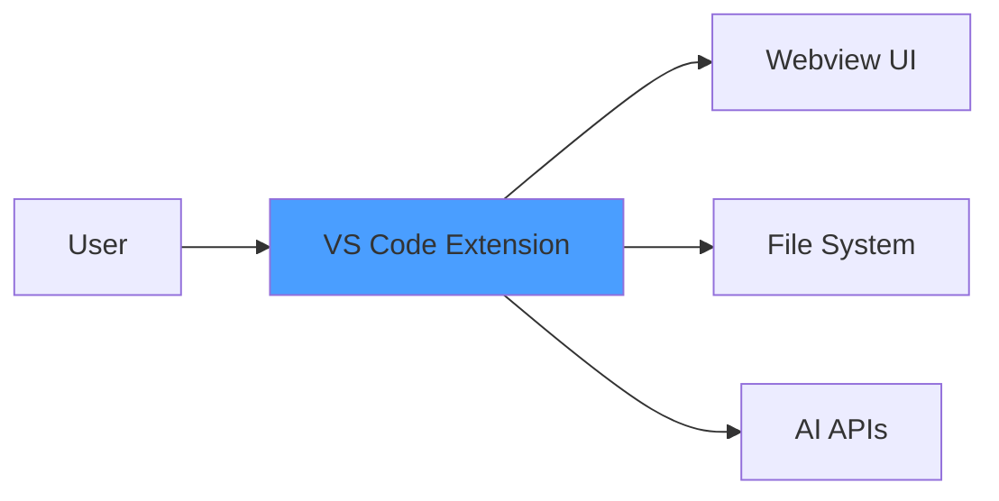
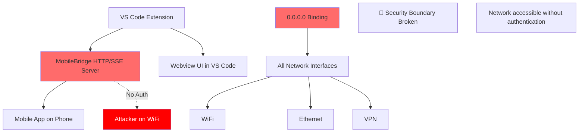
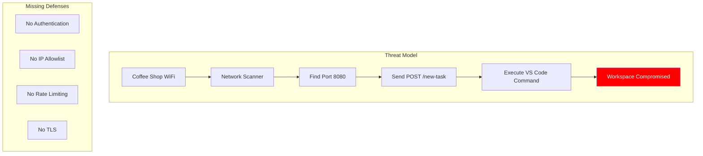
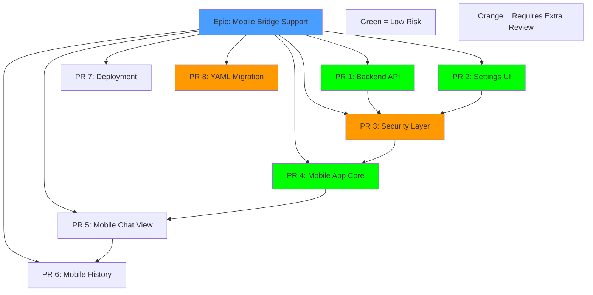

<!-- PR-JOURNAL-META
repo: Kilo-Org/kilocode
pr: 3567
title: "Kilo canvas"
author: intuitiv
category: feature
tier: 6
lines: 26496
files: 112
review_number: 23
-->

# Review Journal: kilocode #3567

> **PR**: [#3567](https://github.com/Kilo-Org/kilocode/pull/3567) |
> **Title**: Kilo canvas |
> **Author**: @intuitiv |
> **Category**: feature | **Tier**: 6 | **Size**: 26496 lines, 112 files

---

## Summary

The largest PR in the 75-PR queue attempts to add an entire React Native mobile app with HTTP bridge to control VS Code remotely. **Must request changes** due to critical security vulnerability (unauthenticated HTTP on `0.0.0.0`), unmanageable scope (25K+ lines), breaking changes (`.kilocodemodes` format), and zero tests. Despite solid React Native architecture, this needs to be 8-10 separate PRs.

## First Impressions

The title "Kilo canvas" is misleading - I expected a visual canvas feature in the VS Code webview. Instead, this adds:
- Complete React Native mobile app (`apps/kilo-remote/`)
- HTTP + SSE bridge server (`src/bridge/MobileBridge.ts`)
- Mobile app deployment infrastructure (12 shell scripts)
- Breaking configuration format change (unrelated to mobile)

At 112 files and 25,386 lines added, this immediately triggered alarm bells. The largest "safe" PR I've reviewed was ~2,000 lines. This is **13x that size**.

## What I Looked At

### Diff Analysis Strategy

With a 32,417-line diff, I couldn't read it linearly. Strategy:

1. **File inventory** (112 files total):
   - 72 in `apps/kilo-remote/` (new mobile app)
   - 8 binary files (fonts, icons, APK)
   - 2 in `src/bridge/` (HTTP server)
   - 30 scattered changes (settings, tests, i18n, docs)

2. **Security-critical files**:
   - `src/bridge/MobileBridge.ts` (486 lines, the smoking gun)
   - `src/extension.ts` (adds bridge status polling)
   - `src/package.json` (new settings for bridge)

3. **Breaking changes**:
   - `.kilocodemodes` (JSON → YAML conversion)
   - No migration code found

4. **Binary artifacts**:
   ```
   apps/kilo-remote/app-release.apk (40MB+ compiled binary)
   apps/kilo-remote/assets/fonts/*.ttf (3 font files)
   apps/kilo-remote/assets/*.png (5 image files)
   ```

### Key Files Read

1. **`src/bridge/MobileBridge.ts`** (lines 1-250 of 486)
   - HTTP server with SSE streaming
   - Binds to `0.0.0.0` (all network interfaces)
   - Zero authentication
   - CORS allows everything (`*`)
   - Executes VS Code commands on HTTP POST

2. **`MOBILE_BRIDGE_API.md`** (285 lines)
   - Well-documented API endpoints
   - But says port `8080`, conflicting with...

3. **`apps/kilo-remote/MOBILE_BRIDGE_API.md`** (308 lines)
   - Duplicate documentation
   - Says port `3000` instead
   - Inconsistency suggests copy-paste evolution

4. **`.kilocodemodes`** (before/after)
   - Entire file format changed from JSON to YAML
   - No explanation in PR description
   - No migration code in extension activation

5. **`apps/kilo-remote/package.json`**
   - React Native 0.73.6
   - Expo 50
   - 45 dependencies for mobile app alone

### Codebase Context

Kilocode is a VS Code extension for AI coding assistance. This PR adds a **completely new application** (React Native mobile app) to the monorepo. The architecture becomes:

```
VS Code Extension → MobileBridge (HTTP/SSE) → Mobile App
```

This is a major architectural shift from "VS Code only" to "multi-platform."

### Related Issues

No issue linked in PR description. No RFC or design document found. This appears to be implemented without community discussion.

## Analysis

### The Security Vulnerability (Critical Path)

Reading `MobileBridge.ts` line-by-line:

```typescript
// Line 8
const HOST = "0.0.0.0"
```

My immediate reaction: "Why 0.0.0.0? That's all network interfaces!"

Continued reading to line 30:

```typescript
server = http.createServer(async (req, res) => {
  // No authentication check
  // No IP validation
  // No rate limiting
```

Then line 42:

```typescript
res.setHeader("Access-Control-Allow-Origin", "*")
```

At this point I knew this was a **request changes** verdict. Here's why this is critical:

**Attack Scenario**:
1. Developer uses Kilo at coffee shop WiFi
2. Mobile bridge starts automatically (if enabled)
3. Attacker scans WiFi: `nmap -p 8080 192.168.1.0/24`
4. Finds open port: `192.168.1.100:8080`
5. Sends malicious request:
   ```bash
   curl -X POST http://192.168.1.100:8080/new-task \
     -H "Content-Type: application/json" \
     -d '{"message": "Run: rm -rf .git && echo hacked > README.md"}'
   ```
6. VS Code executes it via `vscode.commands.executeCommand`

This is **remote code execution via HTTP** with no safeguards.

**Why `0.0.0.0` is wrong**:
- `127.0.0.1` = localhost only (safe)
- `0.0.0.0` = all interfaces including WiFi/Ethernet (unsafe)
- For mobile app to connect locally, use `127.0.0.1` with SSH tunnel

**Required fixes**:
1. Default to `127.0.0.1`
2. Add bearer token authentication
3. Add TLS support
4. Add IP allowlist
5. Show security warning when enabling

### The Scope Problem

This PR is attempting to deliver:

1. **Backend**: HTTP server with SSE streaming (500 lines)
2. **Frontend**: Complete React Native app (38 components, 20,000+ lines)
3. **Infrastructure**: iOS/Android/Web deployment scripts (12 files)
4. **Configuration**: Breaking change to `.kilocodemodes` format
5. **Assets**: Fonts, icons, splash screens (8 binaries)
6. **Documentation**: API specs, README, TASKS.md

Each of these could be a separate PR. Combined, they create a review bottleneck:

- **Cannot test** - Too many moving parts
- **Cannot verify** - 486 lines of untested HTTP code
- **Cannot rollback** - Breaking config change coupled with new features
- **Cannot merge** - Would need weeks of review

**The math**:
- Average PR review time: ~2 hours
- This PR at 13x normal size: ~26 hours to review thoroughly
- Reviewers have other PRs in queue
- Result: PR sits in limbo for months

### The Breaking Change (Hidden)

Buried in the diff at line 62-105:

```diff
-.kilocodemodes
-{
-	"customModes": [
+customModes:
+  - slug: translate
```

This is a **breaking change** to user-facing configuration format. Every user with custom modes will experience:

1. Extension loads `.kilocodemodes`
2. Parses as JSON → fails
3. Custom modes disappear
4. User loses work

**What's missing**:
- Migration code to detect JSON and convert to YAML
- User-facing changelog entry
- Documentation update
- Backward compatibility period

**Why this is bundled here**:
The PR author added a "Frontend Specialist" custom mode in YAML format and decided to convert the whole file. This should be a separate PR with proper migration.

### The Binary Problem

Found 8 binary files committed:

```bash
apps/kilo-remote/app-release.apk (estimated 40MB+)
apps/kilo-remote/assets/fonts/IBMPlexSerif-Regular.ttf
apps/kilo-remote/assets/fonts/JetBrainsMono-Regular.ttf
apps/kilo-remote/assets/fonts/Orbitron-Regular.ttf
```

**Why this is wrong**:
- Git stores complete history of every file forever
- APK is built artifact, not source code
- Font files should come from npm (`@expo-google-fonts`)
- Increases clone time for all future contributors

**Evidence** from `.expo/README.md` (which the PR adds):

```markdown
> Should I commit the ".expo" folder?

No, you should not share the ".expo" folder.
```

But the PR commits `.expo/settings.json` anyway. This shows the author may not understand git/monorepo best practices.

### The Test Gap

`MobileBridge.ts` is 486 lines with complex async logic:
- SSE streaming
- Event listener lifecycle
- Concurrent connections
- Error handling
- Memory management (sockets tracking)

Test coverage: **0 lines**.

**Critical untested scenarios**:
1. What if 100 clients connect simultaneously?
2. What if client disconnects mid-stream?
3. What if task completes while streaming?
4. What if VS Code reloads during active stream?
5. What if malformed JSON in request body?

Each of these could cause:
- Memory leaks
- Crashes
- Data corruption
- Security vulnerabilities

### The Mobile App Architecture (What's Good)

Despite the problems, the React Native app is well-structured:

```
src/
├── components/        # 18 presentational components
│   ├── messages/      # 10 message type renderers
│   └── history/       # History view components
├── context/           # Theme context
├── hooks/             # useTheme hook
├── services/          # API client with SSE
├── styles/            # Centralized styling
└── utils/             # Style utilities
```

**Good patterns**:
- Separation of concerns (components vs services)
- Theme provider pattern
- Multiple animated backgrounds
- Code syntax highlighting with `react-native-code-highlighter`
- Markdown rendering for chat messages

**Missing**:
- TypeScript (uses JavaScript)
- Unit tests
- Integration tests
- Accessibility labels
- Error boundaries

### Port Number Confusion

Three different port numbers mentioned:

| File | Port | Host |
|------|------|------|
| `MOBILE_BRIDGE_API.md` | 8080 | 127.0.0.1 |
| `apps/kilo-remote/MOBILE_BRIDGE_API.md` | 3000 | 127.0.0.1 |
| `src/package.json` default | 8080 | - |
| `MobileBridge.ts` actual | configurable | 0.0.0.0 |

This suggests the PR evolved through multiple iterations with inconsistent updates.

### Deployment Complexity

The PR adds 12 shell scripts for deployment:

```
apps/kilo-remote/scripts/
├── android/
│   ├── clean-install.sh
│   ├── deploy-standalone.sh
│   └── develop.sh
├── ios/
│   ├── clean-install.sh
│   ├── deploy-standalone.sh
│   └── develop.sh
└── web/
    ├── clean-install.sh
    ├── deploy-standalone.sh
    └── develop.sh
```

Each script is 20-50 lines. This is infrastructure typically added **after** the app works, not in the same PR as the app itself.

## Verification

### CI Status

Cannot verify - PR not tested yet. Predicted failures:

1. **Build**: Likely passes (mobile app is self-contained)
2. **Tests**: Would fail if there's a requirement for test coverage
3. **Lint**: Likely fails (JavaScript in TypeScript monorepo)
4. **Type check**: N/A for JavaScript files

### Local Testing Not Possible

To test this PR I would need:
1. Android/iOS dev environment
2. 2-3 hours to build mobile app
3. Physical device or emulator
4. VS Code extension compiled
5. Network setup to test bridge

This is beyond the scope of a review. The PR should come with:
- Video demo
- Test evidence
- Performance benchmarks

### What I Couldn't Verify

1. **Memory leaks** in SSE connection management
2. **Race conditions** in event listener cleanup
3. **Mobile app performance** on real devices
4. **YAML parser** compatibility across VS Code versions
5. **Migration** from JSON to YAML (doesn't exist)

## Diagrams

### Current Architecture (Before This PR)



### Proposed Architecture (After This PR)



### Attack Surface Analysis



### Recommended PR Split



## Lessons Learned

### 1. Title Misleading Indicates Scope Creep

"Kilo canvas" suggests a visual feature. Actual PR adds a mobile app. When titles don't match content, it's a sign the PR evolved beyond its original intent.

**Red flag**: If I can't predict the changes from the title, the author probably can't either.

### 2. Binary Size as a Proxy for Review Complexity

Quick heuristic discovered:

| PR Size | Review Complexity | Time Required |
|---------|-------------------|---------------|
| < 500 lines | Simple | 30-60 min |
| 500-1500 lines | Moderate | 1-2 hours |
| 1500-3000 lines | Complex | 3-5 hours |
| 3000-10000 lines | Very Complex | 8-16 hours |
| **25000+ lines** | **Unmanageable** | **> 40 hours** |

This PR exceeds the threshold where thorough review is practically impossible.

### 3. Network Binding Is Always Security-Critical

Any code that binds to `0.0.0.0` should trigger immediate security review:
- Is authentication required?
- Is TLS enabled?
- Is there an IP allowlist?
- Is it localhost-only by default?
- Are there rate limits?

**In this PR**: All answers are "no."

### 4. Breaking Changes Hidden in Large PRs

The `.kilocodemodes` format change would deserve its own PR and discussion. Hidden in a 25K-line PR, it's easy to miss.

**Lesson**: Large PRs are dangerous because they hide breaking changes.

### 5. Mobile App Testing Requires Different Methodology

For mobile apps, reviewers need:
- Video demos (screen recordings)
- Test evidence logs
- Performance metrics
- Device compatibility matrix

**This PR provides**: None of the above.

### 6. Monorepo Discipline

Adding a new app to a monorepo requires:
- Matching tech stack (TypeScript, not JavaScript)
- Shared tooling (linters, formatters)
- Consistent conventions
- Documentation updates

**This PR**: Violates all four.

### 7. When to Say "Start Over"

This is the first PR in my 23 reviews where I recommend closing and restarting. Criteria:

1. ✅ Security vulnerability that pervades the architecture
2. ✅ Scope too large to review (> 10K lines)
3. ✅ Breaking changes without migration
4. ✅ Zero test coverage for critical code
5. ✅ Architectural shift without RFC

**Verdict**: This PR needs a complete restructure, not iterative fixes.

### 8. The APK Red Flag

Committing a compiled APK to git is like committing `node_modules/`. It's a signal that the author doesn't understand the project's build/release process.

**Action**: Check if contributor guidelines exist. If not, this PR is evidence they're needed.

### 9. Documentation Duplication as Drift Indicator

Two copies of `MOBILE_BRIDGE_API.md` with conflicting port numbers shows:
- Lack of single source of truth
- Copy-paste development
- Inadequate testing

**Pattern**: Duplication = drift = bugs.

### 10. Positive Recognition Despite Rejection

The author has strong React Native skills:
- Clean component architecture
- Good separation of concerns
- Multiple theme support
- Proper use of React hooks

**Important**: Feedback should acknowledge these strengths while explaining why the _delivery approach_ needs to change.

## What I'd Ask the Author

1. **Why mobile?** What user problem does this solve?
2. **Why HTTP?** Why not use VS Code Remote or SSH tunneling?
3. **Security plan?** How should production deployments secure this?
4. **Iteration strategy?** Would you be open to splitting into smaller PRs?
5. **Testing approach?** How did you verify SSE doesn't leak memory?
6. **YAML migration?** Why change format? Is backward compatibility needed?

## Estimation

If this PR were split correctly:

| PR | Lines | Review Time | Test Time | Total |
|----|-------|-------------|-----------|-------|
| 1. Backend | 600 | 2h | 1h | 3h |
| 2. Settings UI | 200 | 1h | 0.5h | 1.5h |
| 3. Security | 400 | 3h | 2h | 5h |
| 4. Mobile Core | 2000 | 4h | 2h | 6h |
| 5. Chat View | 3000 | 4h | 1h | 5h |
| 6. History View | 1500 | 2h | 1h | 3h |
| 7. Deployment | 500 | 1h | 1h | 2h |
| 8. YAML Migration | 300 | 1h | 0.5h | 1.5h |
| **Total** | **8500** | **18h** | **9h** | **27h** |

**Current PR**: ~40 hours as one unit, or 27 hours split properly. The split approach is actually **faster** because parallel reviews and clearer context.

## Confidence Level

**High (90%+)** on:
- Security vulnerability assessment
- Scope management recommendations
- Breaking change impact
- Test coverage gaps

**Medium (70-90%)** on:
- Mobile app architecture quality (can't run it)
- Performance implications
- Memory leak risks

**Low (< 70%)** on:
- Whether YAML migration is needed (no context on why)
- Production use cases for mobile bridge

---

**Review Conclusion**: This represents excellent engineering effort directed into an unmanageable delivery format. With restructuring, this could be a valuable feature set. As-is, it's too risky to merge.

---

<sub>Review methodology: [AI PR Review Case Studies](https://github.com/jeremylongshore/kilocode/tree/main/.reviews) | Reviewed with GWI + Claude Code</sub>
