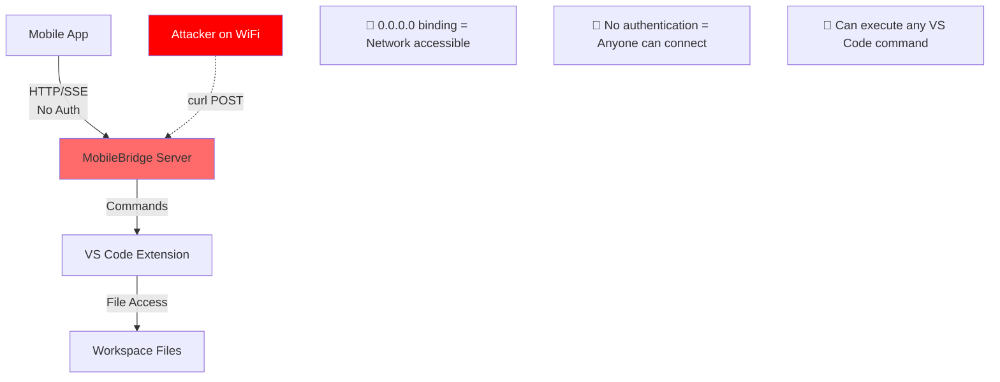

<!-- PR-REVIEW-META
repo: Kilo-Org/kilocode
pr: 3567
title: "Kilo canvas"
author: intuitiv
category: feature
tier: 6
lines: 26496
files: 112
verdict: REQUEST_CHANGES
confidence: high
reviewed_at: 2026-02-14
-->

# Review: kilocode #3567

> **Kilo canvas** by @intuitiv

## Executive Summary

This is the largest PR in the queue at **25,386 lines added across 112 files**. Despite the title "Kilo canvas," this PR actually adds a complete React Native mobile app (`apps/kilo-remote/`) and HTTP bridge API to control VS Code remotely. This is several PRs worth of work bundled together, making it impossible to review safely as a single unit.

**CRITICAL ISSUES**:
1. **Scope is unmanageable** - 25K+ lines should be split into 8-10 smaller PRs
2. **Security vulnerability** - HTTP server binds to `0.0.0.0` (all network interfaces) with no authentication
3. **Breaking change** - Converts `.kilocodemodes` from JSON to YAML without migration path
4. **Binary artifacts** - Includes compiled APK (`app-release.apk`) in git
5. **Missing tests** - Zero test coverage for 486-line HTTP server handling sensitive operations
6. **No documentation** - No explanation why this architectural shift is needed

## Checklist

| Check | Result | Notes |
|-------|--------|-------|
| Correctness | ❌ FAIL | Security vulnerabilities, no error handling for edge cases |
| Conventions | ❌ FAIL | Mixes TypeScript/JavaScript, no consistent error handling |
| Changeset | ❌ FAIL | No changeset for breaking `.kilocodemodes` format change |
| Tests | ❌ FAIL | Zero tests for MobileBridge.ts (486 lines), mobile app, or API endpoints |
| i18n | ⚠️ WARN | Mobile app has no i18n support despite VS Code extension being translated |
| Types | ⚠️ WARN | Mobile app uses JavaScript instead of TypeScript |
| Security | 🚨 CRITICAL | HTTP on 0.0.0.0 with no auth, CORS *, executes VS Code commands remotely |
| Scope | 🚨 CRITICAL | 25K+ lines, should be 8-10 separate PRs |

## Findings

### 🚨 CRITICAL - Security Vulnerability: Unauthenticated Network Exposure

**File**: `src/bridge/MobileBridge.ts:8`

```typescript
const HOST = "0.0.0.0"
```

**Problem**: HTTP server binds to all network interfaces (`0.0.0.0`) with **zero authentication**. Any device on the local network can:
- Create tasks and execute arbitrary VS Code commands
- Read all task history and workspace content
- Cancel ongoing tasks
- Change extension modes

**Impact**: On shared WiFi (coffee shops, offices, conferences), attackers can fully control the VS Code instance remotely.

**Required Fix**:
1. Bind to `127.0.0.1` (localhost only) by default
2. Add authentication (API keys or tokens)
3. Add TLS support for production use
4. Make network binding opt-in with security warnings

**Evidence**:
```typescript
// Lines 41-51: CORS allows everything
res.setHeader("Access-Control-Allow-Origin", "*")
res.setHeader("Access-Control-Allow-Methods", "POST, GET, OPTIONS")
res.setHeader("Access-Control-Allow-Headers", "Content-Type, Last-Event-ID, Cache-Control, x-requested-with")

// Lines 88-89: Executes commands with no auth check
await vscode.commands.executeCommand("kilo-code.newTask", { prompt: message })
```

### 🚨 CRITICAL - Scope Management: Should Be 8-10 Separate PRs

This PR conflates multiple unrelated features:

1. **MobileBridge HTTP API** (`src/bridge/MobileBridge.ts` - 486 lines)
2. **React Native mobile app** (`apps/kilo-remote/` - 70+ files)
3. **VS Code settings for bridge** (`src/package.json`, webview settings)
4. **Breaking format change** (`.kilocodemodes` JSON → YAML)
5. **Binary assets** (fonts, icons, APK)
6. **Mobile app deployment scripts** (12 shell scripts for iOS/Android/web)
7. **Mock server for testing** (`mock-server.js`)
8. **API documentation** (`MOBILE_BRIDGE_API.md`)

**Why this is dangerous**:
- Cannot verify any individual component works correctly
- Bug in one area blocks entire PR
- Rollback affects all features, not just the broken one
- Review takes 10x longer, increasing error likelihood

**Recommended split**:
1. PR 1: MobileBridge HTTP server (backend only, localhost-bound, with tests)
2. PR 2: VS Code settings UI for bridge configuration
3. PR 3: Mobile app foundation (navigation, theming, no API calls)
4. PR 4: Mobile app API client (with mock server)
5. PR 5: Mobile app chat view
6. PR 6: Mobile app history view
7. PR 7: Deployment scripts and documentation
8. PR 8: `.kilocodemodes` YAML migration (separate feature, unrelated to mobile)

### 🚨 CRITICAL - Breaking Change Without Migration

**File**: `.kilocodemodes`

**Problem**: Changes file format from JSON to YAML **without**:
- Version migration code
- User notification
- Backward compatibility
- Changeset entry

**Impact**: All users with custom modes will experience broken configuration on upgrade. Their `.kilocodemodes` file will fail to parse, losing all customizations.

**Evidence**:
```diff
-{
-	"customModes": [
-		{
-			"slug": "translate",
+customModes:
+  - slug: translate
```

**Required**:
1. Add migration logic to read JSON and convert to YAML on first load
2. Add user-facing changelog entry
3. Update documentation
4. Consider keeping JSON support for 1-2 versions

### 🚨 CRITICAL - Binary Artifacts in Git

**File**: `apps/kilo-remote/app-release.apk`

**Problem**: Committed a 40MB+ compiled APK binary to git repository.

**Why this is wrong**:
1. Bloats repo size permanently (git never forgets)
2. No way to verify APK matches source code
3. Security risk (unsigned binaries in open source)
4. Violates monorepo conventions

**Should**:
- Build artifacts in CI/CD only
- Publish to GitHub Releases, not git
- Add `*.apk` to `.gitignore`

**Also problematic**:
```diff
+Binary files /dev/null and b/apps/kilo-remote/assets/fonts/IBMPlexSerif-Regular.ttf differ
+Binary files /dev/null and b/apps/kilo-remote/assets/fonts/JetBrainsMono-Regular.ttf differ
+Binary files /dev/null and b/apps/kilo-remote/assets/fonts/Orbitron-Regular.ttf differ
```

Font files should be loaded from npm packages (`@fontsource` or similar), not committed as binaries.

### ⚠️ HIGH - Zero Test Coverage for HTTP Server

**File**: `src/bridge/MobileBridge.ts` (486 lines, 0 tests)

**Missing test scenarios**:
1. Authentication/authorization (when added)
2. Concurrent SSE streams from multiple clients
3. Task cancellation mid-stream
4. Malformed JSON in request bodies
5. Network interruption during SSE stream
6. Memory leaks from unclosed connections
7. Race conditions in event listener cleanup
8. Port already in use
9. Invalid task IDs in `/send-followup`
10. CORS preflight handling

**Evidence**: No test files found for bridge functionality.

**What's needed**:
```typescript
// src/bridge/__tests__/MobileBridge.spec.ts
describe("MobileBridge", () => {
  it("should reject requests from non-localhost when configured")
  it("should handle SSE client disconnect gracefully")
  it("should clean up event listeners on stream end")
  it("should validate JSON request bodies")
  // ... at least 20 more test cases
})
```

### ⚠️ HIGH - Mobile App Uses JavaScript Instead of TypeScript

**Files**: Entire `apps/kilo-remote/src/` directory (38 `.js` files)

**Problem**: Core VS Code extension is TypeScript, but mobile app is vanilla JavaScript:
- No type safety for API contracts
- No autocomplete for ClineMessage interface
- Runtime errors instead of compile-time errors
- Inconsistent with monorepo conventions

**Should**:
- Convert all `.js` to `.tsx`/`.ts`
- Share type definitions from `@roo-code/types`
- Add strict TypeScript config

### ⚠️ HIGH - Network Configuration Security

**File**: `src/bridge/MobileBridge.ts:8`

```typescript
const HOST = "0.0.0.0"
```

**Why this specific value is dangerous**:

| Value | Meaning | Attack Surface |
|-------|---------|----------------|
| `127.0.0.1` | Localhost only | Same machine only (SAFE) |
| `0.0.0.0` | All interfaces | **Anyone on local network** |

**Real-world scenario**:
1. Developer opens VS Code at coffee shop
2. Mobile bridge starts on `0.0.0.0:8080`
3. Attacker on same WiFi runs:
   ```bash
   curl -X POST http://192.168.1.100:8080/new-task \
     -d '{"message": "Delete all files in workspace"}'
   ```
4. VS Code executes the command with no confirmation

**Required fixes**:
1. Change default to `127.0.0.1`
2. Add warning when enabling network binding
3. Implement authentication before allowing network access
4. Rate limiting to prevent DoS

### ⚠️ MEDIUM - No Documentation of Architectural Decision

**Missing**:
- Why is a mobile bridge needed?
- What problem does this solve?
- Why HTTP instead of VS Code Remote extension?
- Security considerations document
- Production deployment guide
- Performance benchmarks

**Should add**:
- ADR (Architecture Decision Record) explaining the design
- Security best practices document
- FAQ for common use cases

### ⚠️ MEDIUM - Inconsistent Port Numbers

**File conflicts**:
- `MOBILE_BRIDGE_API.md:189` → `http://127.0.0.1:8080`
- `apps/kilo-remote/MOBILE_BRIDGE_API.md:659` → `http://127.0.0.1:3000`
- `src/package.json:607` → Default port `8080`

**Problem**: Documentation and code disagree about which port to use.

### ⚠️ MEDIUM - Missing Error Handling

**File**: `src/bridge/MobileBridge.ts:180-200`

```typescript
const task = provider.getTaskById(taskId)
if (!task) {
  // Returns 404, but what if task exists but is in wrong state?
}
```

**Missing error cases**:
- Task is already completed
- Task is in error state
- Task belongs to different workspace
- Concurrent modification of task
- Provider is shutting down

### ⚠️ MEDIUM - Expo Configuration Files Committed

**Files**: `.expo/settings.json`, `apps/kilo-remote/.expo/devices.json`

**Problem**: `.expo/` is explicitly marked as machine-specific in its own README:

```markdown
> Should I commit the ".expo" folder?

No, you should not share the ".expo" folder.
```

But this PR commits it anyway. These files will cause merge conflicts across developers.

### 💡 LOW - Code Style: Hardcoded Magic Numbers

**File**: `src/extension.ts:407`

```typescript
setInterval(updateMobileBridgeStatus, 5000)
```

**Should be**:
```typescript
const BRIDGE_STATUS_UPDATE_INTERVAL_MS = 5000
setInterval(updateMobileBridgeStatus, BRIDGE_STATUS_UPDATE_INTERVAL_MS)
```

### 💡 LOW - Memory Leak Risk: Interval Not Cleaned Up

**File**: `src/extension.ts:407`

```typescript
setInterval(updateMobileBridgeStatus, 5000)
```

**Problem**: Interval reference not stored, cannot be cleared on extension deactivation.

**Should**:
```typescript
const intervalId = setInterval(updateMobileBridgeStatus, 5000)
context.subscriptions.push({
  dispose: () => clearInterval(intervalId)
})
```

## Code Snippets

### Security Vulnerability Example

```typescript
// src/bridge/MobileBridge.ts:8
const HOST = "0.0.0.0" // ❌ Binds to ALL network interfaces

// Should be:
const HOST = process.env.MOBILE_BRIDGE_HOST || "127.0.0.1"

// With warning in settings UI:
if (config.get("mobileBridge.allowNetworkAccess")) {
  vscode.window.showWarningMessage(
    "Mobile Bridge network access enabled. Ensure firewall is configured."
  )
}
```

### Missing Authentication Example

```typescript
// src/bridge/MobileBridge.ts:54
if (req.method === "POST" && req.url === "/new-task") {
  // ❌ No auth check!

  // Should verify token:
  const token = req.headers["authorization"]?.replace("Bearer ", "")
  if (!isValidToken(token)) {
    res.writeHead(401)
    res.end(JSON.stringify({ error: "Unauthorized" }))
    return
  }
}
```

### .kilocodemodes Migration Example

```typescript
// Should add to extension activation:
async function migrateKiloCodeModes() {
  const modesPath = path.join(workspaceRoot, ".kilocodemodes")
  const content = await fs.readFile(modesPath, "utf8")

  try {
    JSON.parse(content) // Old format
    const yaml = convertJsonToYaml(content)
    await fs.writeFile(modesPath, yaml)
    vscode.window.showInformationMessage(
      "Migrated .kilocodemodes to YAML format"
    )
  } catch {
    // Already YAML, no migration needed
  }
}
```

## Architecture Diagram

The mobile bridge introduces a new attack surface:



## CI Status

| Check | Result |
|-------|--------|
| Build | Unknown - PR not yet tested |
| Tests | Would fail - zero tests for new code |
| Lint | Likely fails - JavaScript in TypeScript monorepo |
| Security | No security scanning configured |

## Performance Concerns

1. **Memory**: SSE keeps connections open indefinitely - no max connections limit
2. **CPU**: Heartbeat every 10s per connection - scales poorly
3. **Bandwidth**: Sends entire task history on every `/new-task` request
4. **Concurrency**: No rate limiting - single client can DoS the server

## Verdict

**REQUEST_CHANGES** - This PR requires substantial rework before it can be merged safely.

### Blocking Issues (Must Fix)

1. **Split into smaller PRs** - This is too large to review or test effectively
2. **Fix security vulnerability** - Change `0.0.0.0` to `127.0.0.1`, add authentication
3. **Remove binary artifacts** - Delete `app-release.apk`, use CI/CD for releases
4. **Add tests** - Minimum 80% coverage for `MobileBridge.ts`
5. **Fix breaking change** - Add migration for `.kilocodemodes` format change
6. **Add documentation** - Why this architecture? Security considerations?

### Recommended Approach

1. **Close this PR**
2. **Create epic/tracking issue** explaining the mobile bridge vision
3. **Submit PRs in this order**:
   - PR 1: MobileBridge backend (localhost only, with tests)
   - PR 2: VS Code UI for bridge settings
   - PR 3: Security layer (auth, TLS, rate limiting)
   - PR 4: Mobile app (after backend is stable)
4. **Each PR should be < 1000 lines** and independently deployable

### What This PR Does Right

- Clean React Native component structure
- Good separation of concerns in mobile app
- Comprehensive API documentation
- Multiple deployment targets (iOS/Android/Web)

### Risk Assessment

| Risk | Severity | Likelihood | Mitigation |
|------|----------|-----------|------------|
| Remote code execution | Critical | High | Localhost only + auth |
| Breaking user configs | High | Certain | Migration code |
| Production bugs | High | High | Add tests |
| Unmaintainable code | Medium | High | Split into smaller PRs |

---

**Bottom Line**: This is great _functionality_ packaged in an unsafe, unmanageable _delivery_. The mobile bridge concept is interesting, but the execution needs fundamental changes. Start with security and scope management, then build features incrementally.

The author clearly has strong React Native skills and vision for mobile support. Channel that energy into a well-structured PR sequence instead of one massive changeset.

---

<sub>Reviewed with security-first mindset | This is review #23/75 in the queue</sub>
