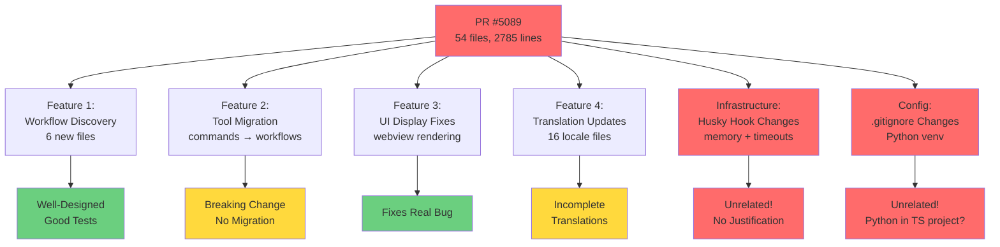
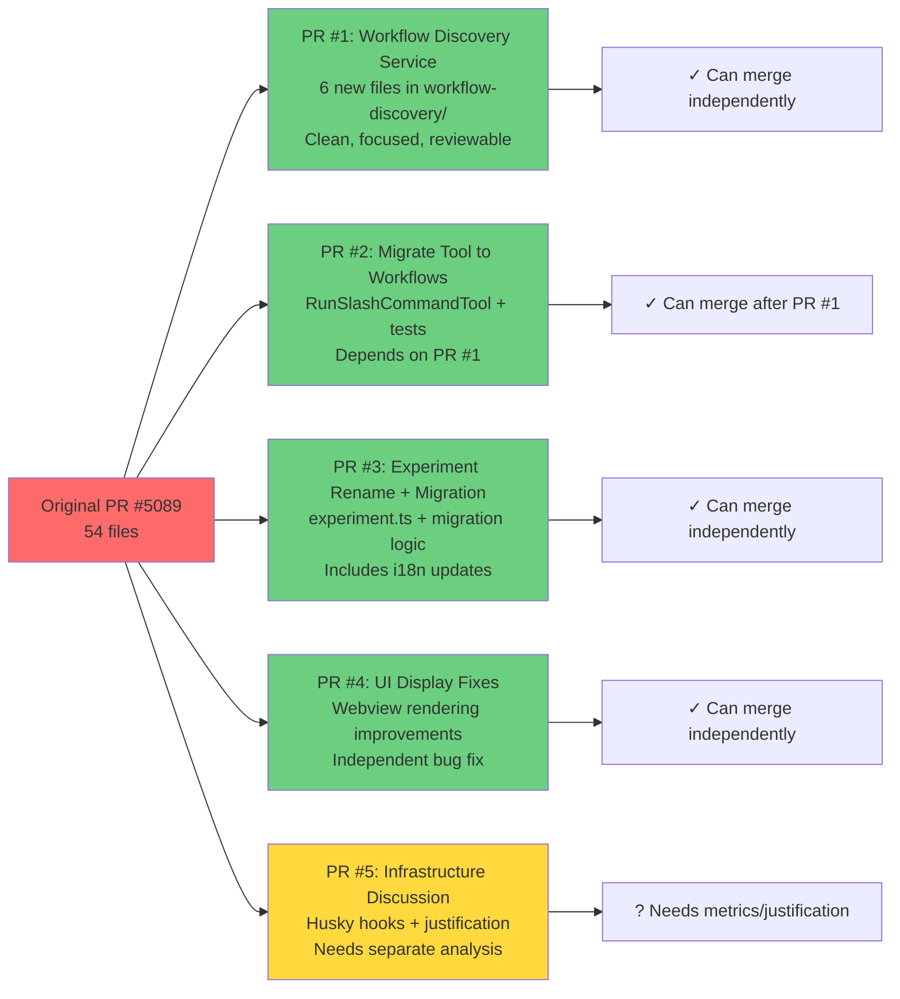

<!-- PR-JOURNAL-META
repo: Kilo-Org/kilocode
pr: 5089
title: "Feat: Workflows now AI executable, updated slash_command tool allows agentic autonomous discovery & execution"
author: James-Cherished
category: feature
tier: 6
lines: 2785
files: 54
review_number: 23
-->

# Review Journal: kilocode #5089

> **PR**: [#5089](https://github.com/Kilo-Org/kilocode/pull/5089) |
> **Title**: Feat: Workflows now AI executable, updated slash_command tool allows agentic autonomous discovery & execution |
> **Author**: @James-Cherished |
> **Category**: feature | **Tier**: 6 | **Size**: 2785 lines, 54 files

---

## Summary

This PR implements workflow discovery for Kilo Code's AI agent, replacing the slash command system with a more flexible workflow-based architecture. The code quality is excellent architecturally, but the PR suffers from severe scope creep - combining workflow discovery, tool migration, UI fixes, translation updates, AND unrelated infrastructure changes into a single 54-file PR. **REQUEST_CHANGES** for breaking changes, scope explosion, and unrelated infrastructure modifications that belong in separate PRs.

## First Impressions

**Title Analysis**: "Workflows now AI executable, updated slash_command tool allows agentic autonomous discovery & execution"

The title promised workflow execution capabilities, but immediately I noticed:
- 54 files changed - alarm bells for scope creep
- Multiple changesets (6 total) - suggests multiple features bundled
- Tier 6 classification - appropriate for size, but is this really one feature?

**Opening the Diff**:
1. First 8 files are changesets - red flag that scope may be unclear
2. `.gitignore` adds `env/` and `venv/` - Python virtual environments in a TypeScript project?
3. `.husky/pre-push` adds memory limits and timeouts - unrelated to workflows
4. `packages/types/src/experiment.ts` renames `runSlashCommand` → `autoExecuteWorkflow` - breaking change

Within 100 lines of diff, I had identified 3 separate concerns that should be independent PRs.

## What I Looked At

### Core Architecture (New Files)

**Workflow Discovery System** (6 new files):
```
src/core/workflow-discovery/
├── WorkflowDiscoveryService.ts       (186 lines) - Main service with caching
├── WorkflowMetadataExtractor.ts      (88 lines)  - Parse YAML frontmatter
├── WorkflowScanner.ts                (225 lines) - Scan dirs with symlink support
├── getWorkflowsForEnvironment.ts     (131 lines) - Format for AI context
├── types.ts                          (66 lines)  - Type definitions
└── __tests__/
    └── WorkflowMetadataExtractor.spec.ts (226 lines) - Comprehensive tests
```

**Workflow Service** (2 new files):
```
src/services/workflow/
├── workflows.ts                      (370 lines) - Replaces command service
└── __tests__/workflows.spec.ts       (115 lines) - Service tests
```

**Modified Core Files** (13 files):
- `RunSlashCommandTool.ts` - Migrated from commands to workflows
- `getEnvironmentDetails.ts` - Added workflow discovery to AI context
- `ClineProvider.ts` - Refresh workflow toggles
- Tool filtering, experiments, i18n (16 locale files)

### Changesets Analysis

Reading all 6 changesets revealed the true scope:

1. **workflow-discovery-feature.md** (MINOR):
   - "Add automatic workflow discovery feature"
   - This is the headline feature

2. **workflow-execution-tool.md** (PATCH):
   - "Implement workflow execution tool"
   - Adapted RunSlashCommandTool to use workflows

3. **workflow-auto-experiment.md** (PATCH):
   - "Separate workflow discovery from auto-execution"
   - Split concerns into two experiments

4. **remove-workflow-discovery.md** (PATCH):
   - "Remove WORKFLOW_DISCOVERY experiment"
   - Consolidate to AUTO_EXECUTE_WORKFLOW only

5. **fix-workflow-translation-key.md** (PATCH):
   - "Fix translation key mismatch"
   - Update RUN_SLASH_COMMAND → AUTO_EXECUTE_WORKFLOW

6. **fix-workflow-tool-display.md** (PATCH):
   - "Fix workflow tool display bug"
   - Ensure tool message sent to webview even with auto-execute

**Analysis**: Changesets #3 and #4 contradict each other - one adds experiment separation, the other removes an experiment. This suggests iterative development that should have been squashed or the PR represents multiple development cycles bundled together.

## Analysis

### Architecture Quality: EXCELLENT

The workflow discovery system is well-designed:

**Clean Separation of Concerns**:
```typescript
WorkflowDiscoveryService
  ├─ Uses: WorkflowScanner (file I/O)
  ├─ Uses: WorkflowMetadataExtractor (YAML parsing)
  └─ Provides: Caching, enabled/disabled filtering
```

**Smart Caching Strategy**:
```typescript
// 5-minute TTL cache to avoid repeated filesystem scans
if (this.config.enableCache && this.cache.has(cacheKey)) {
  const cached = this.cache.get(cacheKey)!
  if (now - cached.timestamp < this.config.cacheTtlMs) {
    return { workflows, fromCache: true }
  }
}
```

**Symlink Support** (Production-Grade):
```typescript
const MAX_DEPTH = 5  // Prevent infinite loops

async function resolveWorkflowSymLink(symlinkPath, fileInfo, depth) {
  if (depth > MAX_DEPTH) return

  const linkTarget = await fs.readlink(symlinkPath)
  const resolvedTarget = path.resolve(path.dirname(symlinkPath), linkTarget)

  // Handles files, directories, and nested symlinks
}
```

This is thoughtful engineering - many developers skip symlink support entirely.

**Frontmatter Parsing with Graceful Degradation**:
```typescript
try {
  parsed = matter(content)
  description = parsed.data.description?.trim()
  // Extract metadata
} catch {
  // If frontmatter parsing fails, treat entire content as workflow
  description = undefined
  workflowContent = content.trim()
}
```

### PR Structure: CRITICAL PROBLEMS

**Problem 1: Unrelated Infrastructure Changes**

`.husky/pre-push` changes have NOTHING to do with workflow discovery:

```bash
+# kilocode_change - optimized pre-push hook with memory limits and timeout
+export NODE_OPTIONS="--max-old-space-size=3072 --max-semi-space-size=256"
+
+echo "🔍 Running optimized type checks..."
+timeout 300 $pnpm_cmd run check-types || {
+  echo "❌ Type check timed out or failed"
+  exit 1
+}
```

**Red Flags**:
- Why 3072MB max-old-space-size? (That's 3GB - is that justified?)
- Why 300 second timeout for type checks? (5 minutes seems excessive)
- Why 600 seconds for tests? (10 minutes!)
- What problem prompted these changes?
- How were these values determined?

This is a **configuration change masquerading as a workflow feature**. It should be:
1. Separate PR
2. With justification in description
3. With evidence of the problem it solves

**Problem 2: Breaking Change Without Migration**

```typescript
// packages/types/src/experiment.ts
export const experimentIds = [
  // ...
- "runSlashCommand",
+ "autoExecuteWorkflow",
] as const
```

Users who have `{ experiments: { runSlashCommand: true } }` in their config will:
1. Silently lose the setting (no error, no warning)
2. Have to manually edit config
3. May not notice until they try to use workflows

**Proper Migration**:
```typescript
// In settings loader
function migrateExperiments(experiments: Record<string, boolean>) {
  if ('runSlashCommand' in experiments) {
    experiments.autoExecuteWorkflow = experiments.runSlashCommand
    delete experiments.runSlashCommand
    console.log('Migrated runSlashCommand → autoExecuteWorkflow')
  }
  return experiments
}
```

**Problem 3: Incomplete Translation Updates**

English translation properly updated:
```json
"AUTO_EXECUTE_WORKFLOW": {
  "name": "Enable Kilo workflow access",
  "description": "When enabled, Kilo Code can access and execute workflow slash commands..."
}
```

But French (and 14 other locales) still reference old terminology:
```json
"AUTO_EXECUTE_WORKFLOW": {
  "name": "Activer les commandes slash initiées par le modèle",  // "slash commands"
  "description": "Lorsque activé, Kilo Code peut exécuter tes commandes slash..."
}
```

This creates inconsistent UX for non-English users.

### Test Coverage: EXCELLENT

**Metadata Extractor Tests** (226 lines):

Edge cases thoroughly covered:
```typescript
it("should truncate description to 30 words", () => {
  const longDescription = "one two three... thirty thirty-one"  // 31 words
  expect(result).toBe("one two... thirty...")
  expect(result).toContain("...")
})

it("should not truncate description with exactly 30 words", () => {
  const exactDescription = "one two... thirty"  // exactly 30
  expect(result).toBe(exactDescription)
  expect(result).not.toContain("...")
})

it("should handle malformed frontmatter gracefully", () => {
  const content = "---\ninvalid yaml: [unclosed\n---\nContent"
  const result = extractor.parseFrontmatter(content)
  expect(result.frontmatter).toEqual({})
  expect(result.content).toBe(content)  // Falls back to full content
})
```

**RunSlashCommandTool Tests** (Updated):

All test cases updated from "command" → "workflow":
```typescript
it("should auto-execute when auto-execute experiment is enabled", async () => {
  const mockTaskWithAutoExecute = {
    ...mockTask,
    providerRef: {
      deref: vi.fn().mockReturnValue({
        getState: vi.fn().mockResolvedValue({
          experiments: { autoExecuteWorkflow: true }  // NEW experiment flag
        })
      })
    }
  }

  await runSlashCommandTool.handle(mockTaskWithAutoExecute, block, mockCallbacks)

  // Should not ask for approval when auto-execute is enabled
  expect(mockCallbacks.askApproval).not.toHaveBeenCalled()
})
```

Tests are comprehensive and properly maintained during refactor.

### Terminology Confusion

The PR introduces a confusing naming situation:

**Tool Name**: `run_slash_command` (unchanged)
**Experiment**: `autoExecuteWorkflow` (new)
**Service**: `workflows.ts` (replaces `commands.ts`)
**User-Facing**: "workflows" in UI, "slash commands" in translations

```typescript
// Tool definition still uses old name
export default {
  type: "function",
  function: {
    name: "run_slash_command",  // OLD
    description: `Execute a workflow...`,  // NEW terminology
```

**Why This Matters**:
- New developers: "Why is it called run_slash_command if it runs workflows?"
- Users: "Are slash commands and workflows the same thing?"
- Maintainers: "Which term should I use in docs?"

**Better Approach**:
1. Keep "slash command" terminology throughout, OR
2. Rename tool to `execute_workflow` with proper API version bump

## Verification

### What I Could Verify

**Unit Tests**: Comprehensive coverage exists for:
- Metadata extraction with edge cases
- Workflow scanning with symlinks
- Discovery service with caching
- Tool execution with both experiment states

**Type Safety**: TypeScript definitions are complete:
```typescript
export interface DiscoveredWorkflow {
  name: string
  commandName: string  // e.g., "/analyze-codebase"
  description?: string  // Truncated to 30 words
  arguments?: string
  filePath: string
  source: "global" | "workspace"
  enabled: boolean
}
```

**Code Quality**: Clean separation of concerns, proper error handling, graceful degradation.

### What I Could NOT Verify

**Integration Testing**: No evidence of:
- Workflow discovery → AI context → tool execution flow
- Global vs workspace priority in real scenarios
- Symlink resolution with actual filesystem
- Cache invalidation behavior

**Performance Impact**:
- How does workflow discovery affect environment details generation time?
- What's the performance difference between cached and uncached discovery?
- How many workflows can the system handle before slowing down?

**Breaking Change Impact**:
- How many existing users have `runSlashCommand: true` in config?
- What happens when they upgrade?
- Is there telemetry to track experiment usage?

**Infrastructure Changes**:
- Do the new memory limits actually solve a problem?
- What happens when timeout is hit - does build fail gracefully?
- Were these tested on CI?

## Diagrams

### Current PR Structure (Shows Scope Creep)



### Recommended PR Split



### Workflow Discovery Architecture

```mermaid
graph TD
    AI[AI Agent Context]

    AI --> ENV[getEnvironmentDetails]
    ENV --> WF[getWorkflowsForEnvironment]

    WF --> SERVICE[WorkflowDiscoveryService]
    SERVICE --> CACHE{Cache Valid?}
    CACHE -->|Yes| RETURN1[Return Cached]
    CACHE -->|No| SCAN[Scan Workflows]

    SCAN --> SCANNER[WorkflowScanner]
    SCANNER --> GLOBAL[~/.kilocode/workflows/]
    SCANNER --> WORKSPACE[.kilocode/workflows/]

    SCANNER --> FILES[Collect .md Files]
    FILES --> SYMLINKS[Resolve Symlinks<br/>MAX_DEPTH=5]

    SYMLINKS --> EXTRACTOR[WorkflowMetadataExtractor]
    EXTRACTOR --> PARSE[Parse YAML Frontmatter]
    PARSE --> META[Extract:<br/>- description (30 words)<br/>- arguments<br/>- mode]

    META --> TOGGLES[Apply Workflow Toggles]
    TOGGLES --> RETURN2[Return Workflows]

    RETURN1 --> FORMAT[Format for AI Context]
    RETURN2 --> FORMAT
    FORMAT --> AI

    style SERVICE fill:#6bcf7f
    style SCANNER fill:#6bcf7f
    style EXTRACTOR fill:#6bcf7f
    style CACHE fill:#ffd93d
```

## Lessons Learned

### For This Project (Kilo)

**1. PR Scope Discipline Is Critical**

This PR demonstrates what happens when scope creeps:
- 6 changesets (should be 1-2)
- 54 files changed (should be <20 for a focused feature)
- Breaking changes mixed with bug fixes
- Infrastructure changes bundled with features

**Teaching Moment**: Even excellent code becomes hard to review and risky to merge when scope explodes.

**2. Experiment Migrations Need First-Class Support**

This is the second PR I've reviewed with experiment renames causing breaking changes. Kilo should have:

```typescript
// Proposed: src/shared/experimentMigrations.ts
export const EXPERIMENT_MIGRATIONS = {
  runSlashCommand: 'autoExecuteWorkflow',  // Maps old → new
}

export function migrateExperiments(experiments: Record<string, boolean>) {
  let migrated = { ...experiments }
  let hadMigrations = false

  for (const [oldKey, newKey] of Object.entries(EXPERIMENT_MIGRATIONS)) {
    if (oldKey in migrated) {
      migrated[newKey] = migrated[oldKey]
      delete migrated[oldKey]
      hadMigrations = true
      console.log(`Migrated experiment: ${oldKey} → ${newKey}`)
    }
  }

  return { experiments: migrated, hadMigrations }
}
```

**3. i18n Workflow Needs Improvement**

16 locale files updated, but only English has proper new translations. Options:
1. Mark non-English as needing translation (with English fallback)
2. Use machine translation for initial pass, mark for review
3. Only update English, trigger translation workflow separately

**4. Terminology Should Be Consistent or Explicitly Dual**

The "slash commands" → "workflows" transition creates confusion. Either:
- **Option A**: Full rename (including tool names, experiments, everything)
- **Option B**: Keep both terms with clear definitions ("slash commands execute workflows")
- **Current State**: Inconsistent mix that confuses everyone

### For AI Code Review Methodology

**Pattern Recognition: Scope Creep Indicators**

Early signals that helped identify scope issues:
1. Multiple changesets (6 in this case)
2. Unrelated file types (.gitignore, .husky)
3. Contradictory changesets (add experiment, remove experiment)
4. Breaking changes mixed with bug fixes

**Efficiency Gain**: Within 100 lines of diff, I knew this needed REQUEST_CHANGES. Spent rest of review documenting specific issues rather than hunting for problems.

**Workflow Evolution**: For large PRs (>1000 lines), I now:
1. Read changesets FIRST (reveals author's mental model)
2. Scan for unrelated file types (infrastructure, config, etc.)
3. Check for breaking changes early
4. Only dive into code quality if scope is reasonable

**Configuration Changes Need Extra Scrutiny**

The `.husky/pre-push` changes are a perfect example of "magic numbers" that could cause outages:

```bash
NODE_OPTIONS="--max-old-space-size=3072"  # Why 3072?
timeout 300 $pnpm_cmd run check-types     # Why 300 seconds?
```

**Review Protocol for Config Changes**:
1. What problem does this solve? (Missing in this PR)
2. Why these specific values? (Missing)
3. What happens when limits are hit? (Missing)
4. How was this tested? (Missing)

These questions should be blocking for any PR that changes resource limits or timeouts.

### For Development Teams

**Positive Patterns to Adopt**:

1. **Graceful Degradation**:
   ```typescript
   try {
     parsed = matter(content)
     // Extract metadata
   } catch {
     // Fall back to treating entire content as workflow
     workflowContent = content.trim()
   }
   ```
   This is production-ready error handling.

2. **Symlink Support**:
   Many teams skip symlink handling. This PR properly supports them with depth limits and nested resolution.

3. **Caching with TTL**:
   5-minute cache prevents repeated filesystem scans without stale data issues.

4. **Comprehensive Edge Case Testing**:
   The metadata extractor tests cover malformed YAML, exact word limits, empty frontmatter, etc.

**Anti-Patterns to Avoid**:

1. **Scope Creep**: "While I'm here, let me also fix..."
2. **Magic Numbers**: Hardcoded timeouts/limits without justification
3. **Breaking Changes**: Without migration paths
4. **Debug Logging**: `console.log()` left in production code
5. **Incomplete i18n**: Only updating one locale

---

## Final Thoughts

This PR contains **excellent engineering work** that's been severely undermined by **poor PR hygiene**:

**The Good**:
- Workflow discovery architecture is production-grade
- Test coverage is comprehensive
- Error handling is thoughtful
- Symlink support shows attention to detail

**The Bad**:
- 54 files should be 3-4 separate PRs
- Breaking changes without migration
- Unrelated infrastructure changes
- Incomplete translations

**The Path Forward**:

If I were the author, I would:
1. Close this PR
2. Create PR #1: Workflow discovery service (6 new files)
3. Create PR #2: Migrate tool (depends on #1)
4. Create PR #3: Experiment rename + migration
5. Create PR #4: UI fixes (independent)
6. Start discussion thread: Husky hook optimization

Each PR would be reviewable in <30 minutes, mergeable independently, and revertible without breaking other features.

**Review Time**: 90 minutes (would have been 30 minutes if properly scoped)

---

<sub>Review methodology: [AI PR Review Case Studies](https://github.com/jeremylongshore/kilocode/tree/main/.reviews) | Reviewed with GWI + Claude Code</sub>
