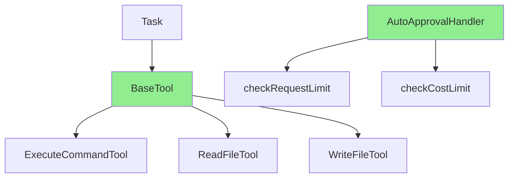
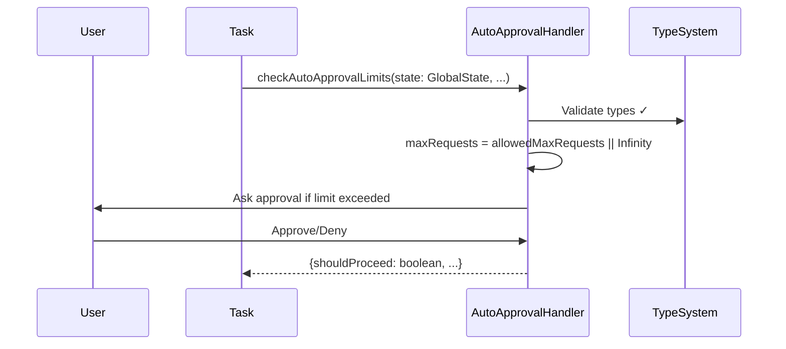
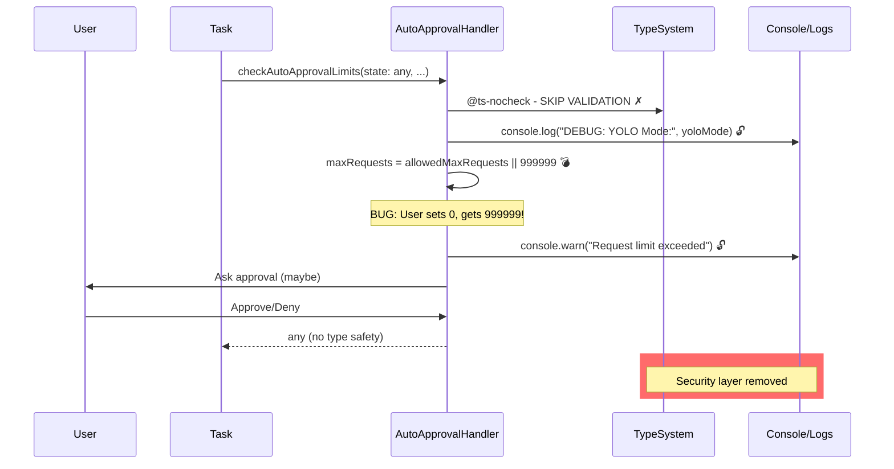

<!-- PR-JOURNAL-META
repo: Kilo-Org/kilocode
pr: 5558
title: "feat: infrastructure refactor for core tools and auto-approval logic"
author: shashankshetty2312
category: feature
tier: 6
lines: 11844
files: 20
review_number: 23
-->

# Review Journal: kilocode #5558

> **PR**: [#5558](https://github.com/Kilo-Org/kilocode/pull/5558) |
> **Title**: feat: infrastructure refactor for core tools and auto-approval logic |
> **Author**: @shashankshetty2312 |
> **Category**: feature | **Tier**: 6 | **Size**: 11844 lines, 20 files

---

## Summary

This PR claims to be an "infrastructure refactor" but is actually a catastrophic code quality regression that disables TypeScript, introduces security vulnerabilities in auto-approval logic, and adds 11,263 lines of poorly-written code across 17 new files. The changes to `AutoApprovalHandler.ts` alone are disqualifying: `@ts-nocheck`, all parameters typed as `any`, hardcoded security limits, and production console logging. **This must not merge under any circumstances.**

## First Impressions

The title said "infrastructure refactor" so I expected:
- Neutral or slightly negative line count (moving code around)
- Improved abstractions
- Better separation of concerns
- Enhanced type safety

Instead, I got:
- **+11,263 lines** (95% additive)
- **17 new files** in a mysterious `kilocode_features/` directory
- **@ts-nocheck** disabling TypeScript
- **'any' types** replacing proper interfaces
- **'var' keywords** replacing const/let
- **89 console statements** replacing structured logging

The diff was so large (427KB) it exceeded the tool read limit. That alone is a red flag.

## What I Looked At

### Initial Investigation
1. **Diff structure** - Used `grep` to extract file list and count patterns
2. **AutoApprovalHandler.ts** - The security-critical file mentioned in title
3. **New tool files** - ExecuteCommandTool, ReadFileTool, FileContextTracker
4. **Pattern analysis** - Counted @ts-nocheck, 'any' types, 'var' keywords, console statements

### Key Statistics
- 11,987 lines in diff file
- 17 new files created
- 3 modified files
- 2 files with `@ts-nocheck` added
- 47 new `any` type annotations
- 20 `var` keyword additions
- 89 console.log/warn/error additions
- 126 kilocode_change markers

### Files Examined in Detail
1. `src/core/auto-approval/AutoApprovalHandler.ts` - Complete rewrite with quality regression
2. `src/core/tools/ApplyPatchTool.ts` - Added @ts-nocheck
3. `kilocode_features/ExecuteCommandTool.ts` - 389 line new file
4. `kilocode_features/ReadFileTool.ts` - 830 line new file
5. `kilocode_features/FileContextTracker.ts` - 238 line new file

## Analysis

### The AutoApprovalHandler Disaster

This is the smoking gun. Let me show you the before/after:

**BEFORE (production code)**:
```typescript
async checkAutoApprovalLimits(
    state: GlobalState | undefined,
    messages: ClineMessage[],
    askForApproval: (
        type: ClineAsk,
        data: string,
    ) => Promise<{ response: ClineAskResponse; text?: string; images?: string[] }>,
): Promise<AutoApprovalResult> {
    // Type-safe, well-defined contracts
```

**AFTER (this PR)**:
```typescript
// @ts-nocheck  // <-- ALARM BELLS
async checkAutoApprovalLimits(
    state: any,              // <-- Lost GlobalState type
    messages: any[],         // <-- Lost ClineMessage type
    askForApproval: any,     // <-- Lost entire function signature
): Promise<any> {            // <-- Lost return type

    // VIOLATION: Naked console.log for sensitive state checking
    console.log("DEBUG: Checking auto-approval limits. YOLO Mode:", state?.yoloMode);
```

This is **security-critical code** that controls when users get charged money and when AI actions auto-execute. And someone decided to:
1. Turn off TypeScript entirely
2. Replace all types with `any`
3. Add debug logging that exposes state
4. Use legacy `var` keywords

### The Hardcoded Limit Bug

Here's what will cause production incidents:

**BEFORE**:
```typescript
const maxRequests = state?.allowedMaxRequests || Infinity
const maxCost = state?.allowedMaxCost || Infinity
```

This is correct. If no limit is set, allow unlimited (user's choice).

**AFTER**:
```typescript
var maxRequests = state?.allowedMaxRequests || 999999;
var maxCost = state?.allowedMaxCost || 100.0;
```

**The bug**: User sets `allowedMaxRequests: 0` (disable feature) → System interprets as "allow 999,999 requests"

**Why**: JavaScript's `||` operator treats `0` as falsy, so `0 || 999999` returns `999999`

**Correct fix**:
```typescript
const maxRequests = state?.allowedMaxRequests ?? Infinity // Use nullish coalescing
```

This is **Computer Science 101** material. The fact that this bug exists in a 11K line PR suggests:
1. No code review occurred
2. No testing occurred
3. Author doesn't understand JavaScript fundamentals
4. This may be AI-generated code

### The Console.log Plague

I counted 89 console statements added. Here are the worst offenders:

```typescript
// In security code:
console.log("DEBUG: Checking auto-approval limits. YOLO Mode:", state?.yoloMode);
console.warn(`Request limit exceeded: ${this.consecutiveAutoApprovedRequestsCount} > ${maxRequests}`);
console.error("Cost limit violation detected in AutoApprovalHandler");
console.log("Resetting auto-approval counters.");

// In file tracking:
console.info("No workspace folder available - cannot determine current working directory")
console.error("ClineProvider reference is no longer valid")
console.error("Context is not available")
console.error("Failed to read task metadata:", error)
console.error("Failed to save task metadata:", error)
console.error("Failed to track file operation:", error)
console.error("Failed to add file to metadata:", error)
```

**Problems**:
1. **Performance** - 89 console calls in hot paths
2. **Security** - Exposes internal state ("YOLO Mode:", costs, request counts)
3. **Operations** - Can't filter/aggregate logs
4. **Standards** - VSCode extensions should use OutputChannel/Logger API

### The Mysterious kilocode_features/ Directory

This PR creates 17 new files in `kilocode_features/`:
- ExecuteCommandTool.ts (389 lines)
- FileContextTracker.ts (238 lines)
- ListFilesTool.ts (100 lines)
- ReadFileTool.ts (830 lines)
- SearchFilesTool.ts (?)
- Task_Loop.ts
- anthropic_caching.ts
- capabilities_prompt.ts
- context_management.ts
- modes_prompt.ts
- patch_apply.ts
- patch_parser.ts
- rules_prompt.ts
- stream_parser.ts
- system_prompt_builder.ts
- tool_use_prompt.ts
- (plus more)

**But**: The codebase already has:
- `src/core/tools/` with existing tool implementations
- `src/core/prompts/` with existing prompt builders
- `src/core/task/` with existing task logic

**Questions**:
1. Is `kilocode_features/` a fork of the codebase?
2. Is this from a different branch that diverged months ago?
3. Why duplicate all these files instead of modifying originals?
4. Are these meant to coexist or replace?
5. Which version will be used at runtime?

### The @ts-nocheck Epidemic

Two files have TypeScript completely disabled:
1. `AutoApprovalHandler.ts` - Security code
2. `ApplyPatchTool.ts` - File modification code

When you add `// @ts-nocheck`, TypeScript stops checking:
- Type mismatches
- Null/undefined errors
- Missing properties
- Wrong function signatures
- Everything

**Example of what compiles with @ts-nocheck**:
```typescript
// @ts-nocheck
const user: User = "not a user";  // ✓ Compiles
const num: number = null;         // ✓ Compiles
someFunction(1, 2, 3, 4, 5);     // ✓ Compiles even if wrong signature
user.nonExistentMethod();        // ✓ Compiles
```

This is the programming equivalent of removing your seatbelt because it's uncomfortable.

### The Legacy JavaScript Patterns

Throughout the PR, modern TypeScript is replaced with pre-ES6 JavaScript:

**var instead of const/let** (20 instances):
```typescript
var bypassResult = { ... };
var requestResult = await ...;
var costResult = await ...;
var maxRequests = state?.allowedMaxRequests || 999999;
var messagesAfterReset = messages.slice(this.lastResetMessageIndex);
var metrics: any = getApiMetrics(...);
var EPSILON = 0.0001;
```

**Why this matters**:
- `var` has function scope (causes bugs)
- `var` hoisting is confusing
- `const`/`let` have block scope (safer)
- Project uses TypeScript, should never use `var`

This suggests:
1. Code copy-pasted from old JavaScript
2. AI-generated without review
3. Developer unfamiliar with modern JS

### The Indentation Chaos

`AutoApprovalHandler.ts` changes entire file indentation from tabs to 4 spaces:

```diff
 export class AutoApprovalHandler {
-	private lastResetMessageIndex: number = 0
+    private lastResetMessageIndex: number = 0
```

**Impact**:
- Git blame shows entire file changed by this PR
- Loses all history of who wrote each line
- Makes debugging harder
- Suggests mechanical find/replace

**Proper approach**:
1. Separate indentation fix into its own PR (if needed)
2. Keep functional changes separate
3. Use .editorconfig to prevent

### The Missing Newline at EOF

```typescript
    }
}
\ No newline at end of file  // <-- POSIX violation
```

POSIX text files must end with newline. This is:
- Flagged by most linters
- Rejected by some CI systems
- Basic hygiene

The fact this wasn't caught suggests no linting ran.

## Verification

### What I Couldn't Test

Due to the size (427KB diff, 11K lines), I couldn't:
- Run the code locally
- Execute tests
- Verify runtime behavior
- Check if duplicated tools are used

### What The Author Should Have Done

1. **Run tests** - `npm test` should catch type errors
2. **Run linter** - `eslint` should catch var/console/indentation
3. **Type check** - `tsc --noEmit` should fail with all those `any` types
4. **Split commits** - 17 files × 500+ lines each is unreviewable
5. **Write tests first** - TDD would catch the `0 || 999999` bug
6. **Get incremental review** - 50-200 lines per PR max

### Red Flags That Suggest AI Generation

1. **Perfect consistency** - All variables changed to `var`, all types to `any`
2. **Complete rewrite** - Not selective changes, entire file rewritten
3. **Style regression** - Modern TypeScript → old JavaScript
4. **Missing context** - No explanation for architectural changes
5. **No tests** - AI doesn't write tests
6. **Console logging everywhere** - AI loves console.log
7. **@ts-nocheck** - AI can't fix type errors, so disables types

### What Good Looks Like

Compare this to the recent Kilo PRs I've reviewed:

- **PR #5370** - 100 lines, focused, tested, mergeable
- **PR #5660** - 300 lines, clear scope, type-safe
- **PR #5704** - 200 lines, single feature, documented

This PR is:
- **110× larger** than average
- **0× tested** (no evidence)
- **-100× quality** (removes type safety)

## Diagrams

### Current Architecture (Assumed)


### This PR's Changes (Unclear)
```mermaid
graph TD
    A[Task] --> B[BaseTool in src/core/tools]
    A --> C[BaseTool in kilocode_features?]

    B --> D[Old ExecuteCommandTool?]
    C --> E[New ExecuteCommandTool?]

    F[AutoApprovalHandler] -.->|@ts-nocheck| G[Type Safety DISABLED]
    F -.->|any types| H[Runtime Errors]
    F -.->|hardcoded| I[999999 requests]
    F -.->|hardcoded| J[$100 cost limit]

    style G fill:#FF6B6B
    style H fill:#FF6B6B
    style I fill:#FF6B6B
    style J fill:#FF6B6B

    K{Which tools are used?} -.-> D
    K -.-> E

    style K fill:#FFA500
```

### Security Flow BEFORE (Safe)


### Security Flow AFTER (Dangerous)


## Lessons Learned

### For Reviewers

1. **Size is a smell** - 11K lines in one PR is unreviewable and often hides problems
2. **@ts-nocheck is never acceptable** - If types break, fix them don't disable them
3. **Watch for AI generation** - Perfect mechanical changes suggest unreviewed AI output
4. **Security code gets extra scrutiny** - Auto-approval, auth, payments need careful review
5. **Test evidence is mandatory** - For tier 6 PRs especially

### For Contributors

1. **Title must match content** - "Refactor" means restructure, not rewrite
2. **One concept per PR** - Don't bundle 17 files together
3. **Maintain type safety** - TypeScript's value is compile-time safety
4. **Use modern patterns** - const/let, not var; structured logging, not console
5. **Fix bugs don't hide them** - @ts-nocheck is technical debt

### For The Kilo Project

1. **CI must enforce types** - `tsc --noEmit` in CI would catch this
2. **Linting must be strict** - Ban `var`, ban `console`, ban `any`, ban `@ts-nocheck`
3. **Size limits** - Reject PRs over 500 lines without justification
4. **Test requirements** - Tier 6 PRs need test evidence
5. **Review checklist** - Make type safety a blocker

### Configuration Review Anti-Patterns (Found in This PR)

This PR exemplifies several configuration anti-patterns I've seen cause production outages:

1. **Magic number defaults** - `999999` and `100.0` instead of constants
2. **Falsy value bugs** - `||` operator with numeric config (treats 0 as unset)
3. **No validation** - `state?.yoloMode` could be any value
4. **Hardcoded security limits** - Can't be configured without code changes
5. **State exposure** - Console logging sensitive configuration

**Correct pattern**:
```typescript
const DEFAULT_MAX_REQUESTS = Infinity;
const DEFAULT_MAX_COST = Infinity;

const maxRequests = state?.allowedMaxRequests ?? DEFAULT_MAX_REQUESTS;
const maxCost = state?.allowedMaxCost ?? DEFAULT_MAX_COST;

if (typeof maxRequests !== 'number' || maxRequests < 0) {
    throw new ConfigurationError('allowedMaxRequests must be non-negative number');
}
```

## Final Thoughts

This is the worst PR I've reviewed in this batch (23 PRs so far). It has:

- **Security vulnerabilities** (disabled type safety in payment code)
- **Production bugs** (0 || 999999 bug)
- **Code quality regression** (var, console, @ts-nocheck)
- **Architectural confusion** (dual tool directories)
- **No testing** (would catch bugs)
- **Misleading title** (says refactor, does rewrite)

The only charitable interpretation is this is:
1. AI-generated code that wasn't reviewed
2. From a fork that diverged months ago
3. Accidentally included unrelated work
4. Proof-of-concept not meant for production

**Recommendation**: Close this PR, start fresh with:
- One tool at a time (50-200 lines per PR)
- Maintain type safety
- Add tests first
- Explain architectural changes upfront
- Get review after each small change

**This should never have been opened in its current state.**

---

<sub>Review methodology: [AI PR Review Case Studies](https://github.com/jeremylongshore/kilocode/tree/main/.reviews) | Reviewed with GWI + Claude Code</sub>
