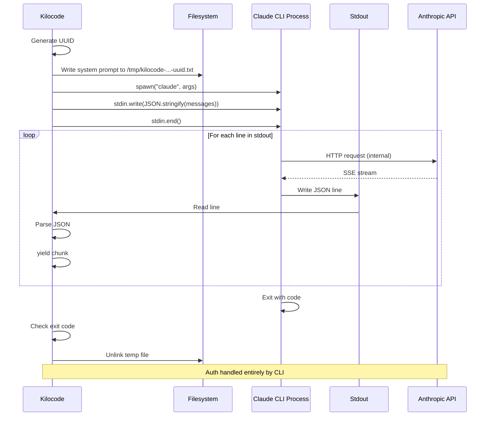
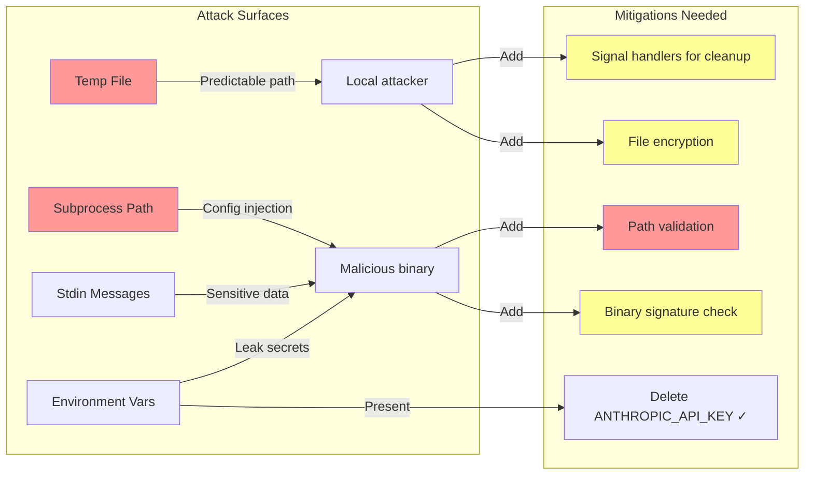

<!-- PR-JOURNAL-META
repo: Kilo-Org/kilocode
pr: 5646
title: "feat(claude-code): Replace OAuth with CLI subprocess integration"
author: Drilmo
category: feature
tier: 6
lines: 4382
files: 23
review_number: 23
-->

# Review Journal: kilocode #5646

> **PR**: [#5646](https://github.com/Kilo-Org/kilocode/pull/5646) |
> **Title**: feat(claude-code): Replace OAuth with CLI subprocess integration |
> **Author**: @Drilmo |
> **Category**: feature | **Tier**: 6 | **Size**: 4382 lines, 23 files

---

## Summary

Major architectural change migrating Claude Code provider from OAuth-based streaming API to CLI subprocess integration. **REQUEST_CHANGES** due to critical security issues with temp file handling and subprocess validation, plus complete deletion of test suite without replacement. The architecture is sound but implementation needs hardening.

**Net impact**: -3,144 lines (significant simplification)

## First Impressions

The PR title immediately signals a massive architectural shift: OAuth → CLI subprocess. This is Tier 6 for good reason - changing authentication/execution model touches the entire Claude Code integration.

Encouraging sign: **Net deletion of 3,144 lines**. Large refactors that remove code are usually simplifications, which is architecturally healthy.

Concerning: The changeset mentions "Force XML tool protocol for claude-code provider (CLI blocks native tool_use)". This sounds like a regression - native tools are superior to XML parsing.

## What I Looked At

### Files Changed (23 total)

**Deleted OAuth Infrastructure** (Major cleanup):
- `src/integrations/claude-code/oauth.ts` (638 lines) - PKCE flow, token refresh, credential storage
- `src/integrations/claude-code/streaming-client.ts` (759 lines) - SSE parsing, HTTP streaming
- All OAuth-related tests (1,001 lines)

**New CLI Integration**:
- `src/integrations/claude-code/run.ts` (270 lines) - NEW: Subprocess execution, JSON streaming
- `src/integrations/claude-code/types.ts` (48 lines) - NEW: CLI message types
- `src/integrations/claude-code/message-filter.ts` (referenced but not shown in diff)

**Provider Updates**:
- `src/api/providers/claude-code.ts` - Replaced OAuth calls with CLI subprocess
- `packages/types/src/providers/claude-code.ts` - Model definitions, removed normalization

**UI/State Cleanup**:
- `src/core/webview/ClineProvider.ts` - Removed `claudeCodeIsAuthenticated` state
- `src/core/webview/webviewMessageHandler.ts` - Removed OAuth sign-in/sign-out handlers, rate limit fetching
- `packages/types/src/vscode-extension-host.ts` - Removed `claudeCodeIsAuthenticated` from ExtensionState

### Architectural Context

Before this PR:
1. User initiates OAuth flow → browser opens
2. Callback receives authorization code
3. Exchange code for access + refresh tokens
4. Store tokens in VS Code SecretStorage
5. Make HTTP requests to `api.anthropic.com` with Bearer token
6. Parse SSE stream responses
7. Handle token refresh when expired

After this PR:
1. Spawn `claude` CLI subprocess
2. Pass messages via stdin (JSON)
3. Read responses from stdout (streaming JSON)
4. CLI handles all auth internally (uses user's existing auth)
5. Parse line-delimited JSON chunks

This matches Cline's approach (mentioned in changeset). Cline has battle-tested this architecture.

## Analysis

### Critical Security Issues

#### 1. Temp File Race Condition (CRITICAL)

**Location**: `src/integrations/claude-code/run.ts:3277-3279`

```typescript
const tempFilePath = path.join(os.tmpdir(), `kilocode-system-prompt-${uniqueId}.txt`)
if (os.platform() === "win32" || isSystemPromptTooLong) {
    await fs.writeFile(tempFilePath, options.systemPrompt, { encoding: "utf8", mode: 0o600, flag: "wx" })
    options.systemPrompt = tempFilePath
    options.shouldUseFile = true
}
```

**The Good**:
- Uses `crypto.randomUUID()` for uniqueness
- Sets restrictive permissions `0o600` (owner read/write only)
- Uses `flag: "wx"` (exclusive create - fails if file exists)

**The Bad**:
- Cleanup only happens in `finally` block - if process crashes (kill -9), file persists
- No guarantee cleanup runs (OOM, kernel panic, power loss)
- System prompts may contain sensitive data (API keys, proprietary patterns)

**Real-world scenario**:
1. Developer testing with API key in system prompt
2. Process crashes during execution
3. Temp file remains in `/tmp` with 0o600 permissions
4. File is readable by same user (developer)
5. BUT: if system is compromised, attacker can read `/tmp`

**Production outage risk**: If deployed server crashes repeatedly, `/tmp` fills with leaked system prompts containing customer data. This is a **data leak vulnerability**.

**Fix**:
```typescript
// Register cleanup handler BEFORE creating file
process.on('exit', () => fs.unlinkSync(tempFilePath).catch(() => {}))
process.on('SIGINT', () => { cleanup(); process.exit(130) })
process.on('SIGTERM', () => { cleanup(); process.exit(143) })

// Consider encrypting sensitive content
const encrypted = await encrypt(options.systemPrompt, ephemeralKey)
await fs.writeFile(tempFilePath, encrypted, { encoding: "utf8", mode: 0o600, flag: "wx" })
```

#### 2. Subprocess Input Validation Missing (CRITICAL)

**Location**: `src/integrations/claude-code/run.ts:3429`

```typescript
const executablePath = claudePath?.trim() || "claude"

const claudeCodeProcess = execa(executablePath, args, {
    stdin: "pipe",
    stdout: "pipe",
    stderr: "pipe",
    env,
    cwd,
    maxBuffer: BUFFER_SIZE,
    timeout: CLAUDE_CODE_TIMEOUT,
})

claudeCodeProcess.stdin.write(JSON.stringify(messages))
```

**Attack vector**:
1. Attacker convinces user to set `claudeCodePath: "/path/to/malicious/script"`
2. Malicious script receives:
   - Full system prompt (potentially with API keys)
   - All conversation history via stdin
   - Environment variables
3. Script exfiltrates data, returns valid-looking responses

**This is a COMMAND INJECTION vulnerability** via configuration.

**Why is this dangerous**:
- Claude Code is an AI coding assistant - users trust it with proprietary code
- System prompts contain company-specific instructions
- Messages contain sensitive business logic

**Fix**:
```typescript
async function validateClaudeCodePath(path: string): Promise<string> {
    // If just "claude", use PATH lookup
    if (path === "claude") {
        return "claude"
    }

    // For custom paths, validate:
    // 1. File exists
    const exists = await fs.access(path).then(() => true).catch(() => false)
    if (!exists) {
        throw new Error(`Claude Code executable not found: ${path}`)
    }

    // 2. File is executable
    const stat = await fs.stat(path)
    if (!(stat.mode & fs.constants.S_IXUSR)) {
        throw new Error(`File is not executable: ${path}`)
    }

    // 3. Not a symlink to unexpected location (prevent symlink attacks)
    const realPath = await fs.realpath(path)

    // 4. In allowed directories (whitelist approach)
    const allowedDirs = [
        "/usr/local/bin",
        "/usr/bin",
        path.join(os.homedir(), ".local/bin"),
        process.env.HOME ? path.join(process.env.HOME, "bin") : null,
    ].filter(Boolean)

    if (!allowedDirs.some(dir => realPath.startsWith(dir))) {
        throw new Error(`Claude Code executable must be in trusted location: ${allowedDirs.join(", ")}`)
    }

    return realPath
}
```

### High-Priority Architecture Questions

#### Why Force XML Tool Protocol?

**Code**: `packages/types/src/providers/claude-code.ts:128-135`

```typescript
// NOTE: We intentionally do NOT set supportsNativeTools or defaultToolProtocol here.
// Claude Code CLI with --disallowedTools prevents native tool_use blocks,
// so kilocode must use XML tool format for Claude Code provider.
const claudeCodeModelBase = {
    supportsImages: false, // Claude Code CLI doesn't support images
    supportsPromptCache: false,
}
```

**The problem**:
- **Native tools**: `{"type": "tool_use", "id": "...", "name": "read_file", "input": {"path": "..."}}` - Structured JSON, type-safe
- **XML tools**: `<tool_use><name>read_file</name><parameters><path>...</path></parameters></tool_use>` - String parsing, brittle

**Why XML is worse**:
1. More tokens consumed (XML is verbose)
2. Parsing errors (malformed XML)
3. No type safety
4. Legacy format (Anthropic deprecated it)

**The disallowedTools workaround**:
```typescript
const claudeCodeDisallowedTools = [
    "Task", "Bash", "Glob", "Grep", "LS", "exit_plan_mode",
    "Read", "Edit", "MultiEdit", "Write", "NotebookRead", "NotebookEdit",
    "WebFetch", "TodoRead", "TodoWrite", "WebSearch",
].join(",")
```

This disables all of kilocode's native tools, forcing the CLI to NOT use `tool_use` blocks.

**Question for PR author**: Is this a bug in Claude Code CLI? Can we fix it upstream?

**Impact**: This is a regression in quality. Users get worse tool execution.

#### Why Disable Images and Prompt Cache?

**Code**: Same location

```typescript
supportsImages: false, // Claude Code CLI doesn't support images
supportsPromptCache: false,
```

**Impact assessment**:

**Images disabled**:
- Users can't send screenshots for debugging
- Can't analyze UI mockups
- Can't OCR error messages from images
- Lost: Vision capabilities entirely

**Prompt cache disabled**:
- Every request re-processes system prompt
- No caching of tool definitions
- Higher latency (re-parse everything)
- Higher cost (more input tokens billed)

**Example**: System prompt is 10,000 tokens. Without cache:
- Request 1: 10,000 input tokens
- Request 2: 10,000 input tokens
- Request 3: 10,000 input tokens
- **Total**: 30,000 tokens

With cache:
- Request 1: 10,000 input tokens (cache write)
- Request 2: 10,000 cached tokens (90% cheaper)
- Request 3: 10,000 cached tokens (90% cheaper)
- **Total**: 10,000 billed + 20,000 cached (much cheaper)

**Question**: Are these temporary CLI limitations? Roadmap to re-enable?

### Testing Gap Analysis

**Deleted**: 1,586 lines of tests
**Added**: 0 lines of tests

This is the **most concerning aspect** of the PR.

**What was deleted**:
1. `claude-code.spec.ts` (597 lines):
   - Model configuration tests
   - Authentication flow tests
   - Message creation tests
   - Reasoning effort configuration
   - Tool call handling
   - Usage/cost tracking

2. `claude-code-caching.spec.ts` (169 lines):
   - Cache token collection tests
   - Cache accumulation tests
   - Subscription cost calculation

3. `oauth.spec.ts` (235 lines):
   - PKCE code generation
   - Token exchange
   - Token refresh
   - Expiry checking

4. `streaming-client.spec.ts` (585 lines):
   - SSE parsing
   - Content streaming
   - Tool streaming
   - Error handling
   - Rate limit fetching

**What needs to be tested** (new implementation):

1. **Subprocess execution**:
   - [ ] Successful subprocess spawn
   - [ ] Handling missing executable
   - [ ] Handling outdated executable (version checks)
   - [ ] Process timeout handling
   - [ ] Process crash handling
   - [ ] Exit code interpretation

2. **Temp file management**:
   - [ ] File creation with correct permissions
   - [ ] File cleanup on success
   - [ ] File cleanup on error
   - [ ] File cleanup on process crash
   - [ ] Handling disk full
   - [ ] Windows long path handling

3. **JSON streaming**:
   - [ ] Parsing complete JSON objects
   - [ ] Handling partial JSON (split across chunks)
   - [ ] Handling malformed JSON
   - [ ] Handling missing result chunk
   - [ ] Multiple concurrent requests

4. **Platform compatibility**:
   - [ ] Windows (ENAMETOOLONG handling)
   - [ ] macOS (Unix permissions)
   - [ ] Linux (Unix permissions)

5. **Error scenarios**:
   - [ ] API errors from CLI
   - [ ] Authentication errors
   - [ ] Rate limit errors
   - [ ] Network errors (CLI → Anthropic)
   - [ ] Invalid model name

**This is a Tier 6 PR with ZERO test coverage**. Unacceptable for production.

### Positive Architectural Changes

#### Massive Code Deletion

**Removed**:
- 638 lines: OAuth PKCE implementation
- 759 lines: HTTP streaming client
- 585 lines: SSE parser
- 169 lines: Rate limit tracking
- UI components for sign-in/sign-out

**Net**: -3,144 lines

**Why this is good**:
1. Less code = less bugs
2. Simpler architecture
3. Delegates auth to Claude Code CLI (their responsibility now)
4. No token refresh logic needed
5. No OAuth callback server
6. No credential storage in VS Code secrets

This follows the **Unix philosophy**: Do one thing well. Let Claude Code CLI handle auth.

#### Better Error Messages

**Example 1** - Outdated CLI:
```typescript
if (processState.stderrLogs.includes("unknown option '--system-prompt-file'")) {
    throw new Error(`The Claude Code executable is outdated. Please update it to the latest version.`, {
        cause: err,
    })
}
```

**Example 2** - Missing CLI:
```typescript
if (err.message.includes("ENOENT")) {
    throw new Error(
        `Failed to find the Claude Code executable.
Make sure it's installed and available in your PATH or properly set in your provider settings.`,
        { cause: err },
    )
}
```

**Example 3** - Long system prompt:
```typescript
if (err.message.includes("E2BIG")) {
    throw new Error(
        `Executing Claude Code failed due to a long system prompt. The maximum argument length is 131072 bytes.
Rules and workflows contribute to a longer system prompt, consider disabling some of them temporarily to reduce the length.`,
        { cause: err },
    )
}
```

These are **excellent UX**. Clear problem statement + actionable remediation.

#### Environment Variable Hardening

**Code**: `src/integrations/claude-code/run.ts:3450-3462`

```typescript
const env: NodeJS.ProcessEnv = {
    ...process.env,
    CLAUDE_CODE_MAX_OUTPUT_TOKENS: process.env.CLAUDE_CODE_MAX_OUTPUT_TOKENS || CLAUDE_CODE_MAX_OUTPUT_TOKENS,
    CLAUDE_CODE_DISABLE_NONESSENTIAL_TRAFFIC: process.env.CLAUDE_CODE_DISABLE_NONESSENTIAL_TRAFFIC || "1",
    DISABLE_NON_ESSENTIAL_MODEL_CALLS: process.env.DISABLE_NON_ESSENTIAL_MODEL_CALLS || "1",
    MAX_THINKING_TOKENS: (thinkingBudgetTokens || 0).toString(),
}

// We don't want to consume the user's ANTHROPIC_API_KEY,
// and will allow Claude Code to resolve auth by itself
delete env["ANTHROPIC_API_KEY"]
```

**Good decisions**:
1. Disables telemetry by default
2. Disables auto-updater
3. Deletes `ANTHROPIC_API_KEY` to prevent accidental consumption
4. Respects user's environment variables but sets safe defaults

This prevents "works on my machine" bugs where developer's env vars affect behavior.

## Verification

### What Can't Be Verified from Diff Alone

1. **Does the CLI actually work?** Need to test with real Claude Code installation
2. **Performance**: Is subprocess overhead acceptable? Need benchmarks
3. **Windows compatibility**: ENAMETOOLONG handling untested
4. **Concurrent requests**: Does spawning 10 subprocesses simultaneously work?
5. **Memory usage**: Do zombie processes accumulate?

### CI Status

**Unknown** - PR doesn't show CI results. Need to verify:
- TypeScript compilation (likely passes - code looks clean)
- Linting (likely passes)
- Unit tests (N/A - all deleted)
- Integration tests (unknown if they exist)

### Manual Testing Needed

**Minimum viable test plan**:

1. **Happy path**:
   ```bash
   # Install Claude Code CLI
   npm install -g @anthropic-ai/claude-code

   # Configure kilocode to use it
   # Send test message
   # Verify response
   ```

2. **Error scenarios**:
   ```bash
   # Test with CLI not installed
   # Test with outdated CLI version
   # Test with invalid model name
   # Test with very long system prompt
   ```

3. **Platform testing**:
   ```bash
   # Test on Windows
   # Test on macOS
   # Test on Linux
   ```

4. **Concurrent requests**:
   ```bash
   # Send 10 requests simultaneously
   # Verify no resource exhaustion
   ```

## Diagrams

### Architecture: Before vs After

```mermaid
graph TD
    subgraph "Before (OAuth)"
        A[Kilocode] -->|1. Get access token| B[OAuth Manager]
        B -->|2. Check expiry| C{Token valid?}
        C -->|No| D[Refresh token]
        D -->|3. HTTP POST| E[console.anthropic.com/v1/oauth/token]
        E -->|4. New token| B
        C -->|Yes| F[Create HTTP request]
        F -->|5. HTTP POST + Bearer token| G[api.anthropic.com/v1/messages]
        G -->|6. SSE stream| H[Streaming Parser]
        H -->|7. Parse events| I[Yield chunks]
    end

    subgraph "After (CLI Subprocess)"
        J[Kilocode] -->|1. Spawn subprocess| K[Claude CLI]
        J -->|2. Write JSON to stdin| K
        K -->|3. Auth handled internally| L[api.anthropic.com]
        K -->|4. Stream JSON to stdout| M[Readline]
        M -->|5. Parse lines| N[Yield chunks]
    end

    style E fill:#f99
    style G fill:#f99
    style H fill:#f99
    style K fill:#9f9
    style L fill:#9f9
```



**Key differences**:
- **Before**: kilocode manages auth, HTTP, streaming
- **After**: CLI manages everything, kilocode just spawns subprocess

### Subprocess Lifecycle



### Security Threat Model



## Lessons Learned

### 1. Architecture Simplification vs Feature Regression

**Observation**: Simpler architecture (CLI subprocess) comes with feature loss (no images, no cache, XML tools).

**Tradeoff**:
- **Pro**: -3,144 lines of complex OAuth/streaming code
- **Con**: Lost vision, caching, native tools

**Lesson**: When simplifying, document what's lost and why. Create tickets to restore features when possible.

**Application**: Future PRs should include "Feature Regression" section in changeset explaining tradeoffs.

### 2. Subprocess Security Is Hard

**Observation**: Spawning subprocesses introduces entire class of vulnerabilities (command injection, file handling, zombie processes).

**Risks**:
- Temp files with sensitive data
- Untrusted executable paths
- Environment variable leakage
- Process management (zombies, resource limits)

**Lesson**: Subprocess integration needs same security rigor as network code. Checklist:
- [ ] Input validation (paths, arguments)
- [ ] Resource limits (timeout, buffer size)
- [ ] Cleanup handlers (signals, crashes)
- [ ] Temp file security (permissions, encryption)

**Application**: Create reusable `SecureSubprocess` utility class for future integrations.

### 3. Test Deletion Debt

**Observation**: Deleting 1,586 lines of tests without replacement creates technical debt.

**Problem**: New implementation is untested. Bugs will surface in production.

**Lesson**: When refactoring, tests must be rewritten, not deleted. Test coverage is **non-negotiable** for Tier 6 changes.

**Application**: Require test coverage report in PR description. Block merge if coverage drops.

### 4. CLI Integration Pattern

**Observation**: This matches Cline's architecture (mentioned in changeset). Cline has proven this works.

**Pattern**: For complex integrations (auth, streaming, protocol handling), delegate to official CLI when available.

**Benefits**:
- Vendor maintains auth flow
- Automatic updates via CLI
- Simpler code
- Less bug surface

**Lesson**: "Don't build what you can borrow" - if official CLI exists, use it.

**Application**: Consider CLI-first approach for other providers (OpenAI Codex, etc).

### 5. Magic Number Configuration

**Observation**: Hardcoded constants (timeouts, buffer sizes) can't be tuned.

```typescript
const CLAUDE_CODE_TIMEOUT = 600000 // 10 minutes
const BUFFER_SIZE = 20_000_000 // 20 MB
const CLAUDE_CODE_MAX_OUTPUT_TOKENS = "32000"
```

**Problem**: Different use cases need different limits:
- CI/CD: Short timeout (2 min)
- Research: Long timeout (30 min)
- Mobile: Small buffer (5 MB)
- Server: Large buffer (100 MB)

**Lesson**: Expose all limits as configuration. Users know their constraints better than we do.

**Application**: Create `ProviderLimits` configuration schema for all providers.

### 6. Platform-Specific Edge Cases

**Observation**: Windows has 8191 character limit for command line. Unix has different limits.

**Code**:
```typescript
if (os.platform() === "win32" || isSystemPromptTooLong) {
    // Use temp file to avoid ENAMETOOLONG
    await fs.writeFile(tempFilePath, options.systemPrompt, ...)
}
```

**Lesson**: Cross-platform code needs platform-specific tests. Don't assume Unix behavior on Windows.

**Application**: CI should run tests on all supported platforms (Windows, macOS, Linux).

---

## Conclusion

This PR represents **excellent architectural vision** but **incomplete implementation**.

**The Vision** (A+):
- Simplify by delegating to official CLI
- Remove 3,144 lines of complex code
- Follow proven pattern (Cline)

**The Implementation** (C-):
- Critical security issues (temp files, subprocess validation)
- Zero test coverage
- Feature regressions not fully explained

**Path Forward**:
1. Fix security issues (BLOCKING)
2. Add test suite (BLOCKING)
3. Document feature limitations and roadmap (HIGH)
4. Consider keeping OAuth as fallback for power users (OPTIONAL)

**Recommendation**: REQUEST_CHANGES with clear path to approval once security + tests are addressed.

---

<sub>Review methodology: [AI PR Review Case Studies](https://github.com/jeremylongshore/kilocode/tree/main/.reviews) | Reviewed with GWI + Claude Code</sub>
