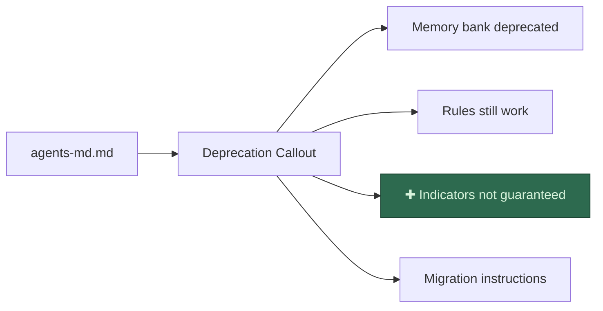

<!-- PR-JOURNAL-META
repo: Kilo-Org/kilocode
pr: 5667
title: "docs: clarify memory bank status indicators"
author: Olusammytee
category: docs
tier: 1
lines: 2
files: 1
review_number: 1
fork_pr: https://github.com/jeremylongshore/kilocode/pull/4
-->

# Review Journal: kilocode #5667

> **PR**: [#5667](https://github.com/Kilo-Org/kilocode/pull/5667) |
> **Title**: docs: clarify memory bank status indicators |
> **Author**: @Olusammytee |
> **Category**: docs | **Tier**: 1 | **Size**: 2 lines, 1 file | **Confidence**: 5/5
>
> **Multi-AI analysis**: [Fork PR #4](https://github.com/jeremylongshore/kilocode/pull/4) — CodeRabbit, Gemini, Greptile, CodeQL, Qodo

---

## Summary

This PR adds a one-sentence clarification to the memory bank deprecation notice in the AGENTS.md docs page. It directly addresses issue [#3837](https://github.com/Kilo-Org/kilocode/issues/3837) where a user couldn't find the status indicators described in the docs. The wording was refined through maintainer feedback to accurately state that indicators _can_ appear but aren't guaranteed. Clean and ready to merge.

## First Impressions

The `docs:` prefix and "clarify" verb signal a low-risk documentation improvement. At 2 lines and 1 file, this is the smallest possible PR - a good test of whether the review process adds value even for trivial changes.

What I expected: a wording softening in a docs page about memory bank.
What I found: exactly that, but with an interesting backstory.

## What I Looked At

1. **The PR itself** - 2 commits, 6 comments showing active discussion with maintainer @olearycrew
2. **Issue [#3837](https://github.com/Kilo-Org/kilocode/issues/3837)** - User report: followed memory bank docs, expected status indicators, couldn't find them
3. **The target file on main** - `apps/kilocode-docs/pages/customize/agents-md.md` (170 lines, Markdoc format)
4. **PR comment history** - Author originally targeted `memory-bank.md` which was removed from main. Rebased, relocated the fix to `agents-md.md`. @olearycrew challenged accuracy ("I still see those indicators"), author refined wording.

## Analysis

The change inserts one paragraph into the deprecation callout:

```diff
 **Existing memory bank rules will continue to work.**
+
+Legacy Memory Bank status indicators such as `[Memory Bank: Active]` and
+`[Memory Bank: Missing]` can still appear, but they are not guaranteed
+across all clients or modes.

 If you'd like to migrate your memory bank content to AGENTS.md:
```

**Why this wording works**: It threads a needle. The indicators _do_ still show up sometimes (as @olearycrew confirmed), but they're not reliable across all clients/modes (as the #3837 reporter discovered). "Can still appear, but are not guaranteed" captures both truths without contradicting either experience.

**Placement**: Inside the `` deprecation notice at the top of the AGENTS.md page. Users confused about memory bank land here first. The clarification sits between "existing rules still work" and migration instructions - logical flow.

## Verification

All relevant CI checks pass:

```
Build Markdoc Site     PASS    (directly relevant - docs build)
check-translations     PASS    (directly relevant - no broken strings)
compile                PASS
test-extension         PASS    (ubuntu + windows)
test-webview           PASS    (ubuntu + windows)
unit-test              PASS
build-cli              PASS
test-cli               PASS
test-jetbrains         FAIL    (pre-existing, unrelated)
Vercel                 SKIP    (auth required for external contributors)
```

No local verification needed for a 2-line docs change with green CI.

## Diagrams

Change location within the deprecation callout block:



## Bot Review Synthesis

| Bot | Verdict | Key Finding | Useful? |
|-----|---------|-------------|---------|
| CodeRabbit | Approve | Trivial (~2 min), correct diff, no issues found | Accurate on correct diff |
| Gemini | Approve | Clean summary, one minor phrasing suggestion | Useful - caught readability nit |
| Greptile | No response | Did not comment on this PR | Needs investigation |
| CodeQL | N/A | No security findings (docs-only) | Expected |
| Qodo | Failed | No OpenAI key configured in fork | Config needed |

**Methodology lessons**:
1. API file replacement (contents PUT) creates wrong diffs. Bots reviewed a 169-line deletion + 171-line addition instead of +2 lines. Fixed by cherry-picking via Codespace with `git fetch upstream pull/{NUM}/head`.
2. After fixing the diff, CodeRabbit and Gemini both gave accurate, useful reviews. The diff quality directly determines bot review quality.
3. Codespace `premiumLinux` (32GB RAM) required for `pnpm check-types`. The `basicLinux32gb` name is misleading - it's only 8GB RAM (32gb = storage).

## Lessons Learned

**1. Docs PRs don't need changesets.** The changeset-bot warning is noise for pure documentation changes in `apps/kilocode-docs/`. No version bump is triggered.

**2. Contributor resilience matters.** When the original target file (`memory-bank.md`) was removed from main between PR creation and review, the author didn't abandon the PR. They rebased, found the new home for the content, and force-pushed. Worth acknowledging.

**3. "Is this true?" is a high-value review question.** @olearycrew's challenge ("I still see those indicators") forced a wording refinement that made the final version more accurate than the original. Simple factual challenges during review are underrated.

**4. CI triage by file scope.** When a PR only touches `apps/kilocode-docs/`, only `Build Markdoc Site` and `check-translations` are directly relevant checks. Other failures (like `test-jetbrains`) can be safely marked as pre-existing and unrelated.

**5. Fork PRs must use cherry-pick, not API file replacement.** The GitHub contents API creates a full file replacement commit. Bots see "169 lines deleted, 171 lines added" instead of "+2 lines." For accurate bot analysis, clone the fork, fetch the upstream PR branch, cherry-pick, and push. The diff must match the upstream diff exactly.

---

<sub>Review #1 of 75 | Review methodology: [AI PR Review Case Studies](https://github.com/jeremylongshore/kilocode/tree/main/.reviews) | Reviewed with GWI + Claude Code</sub>
