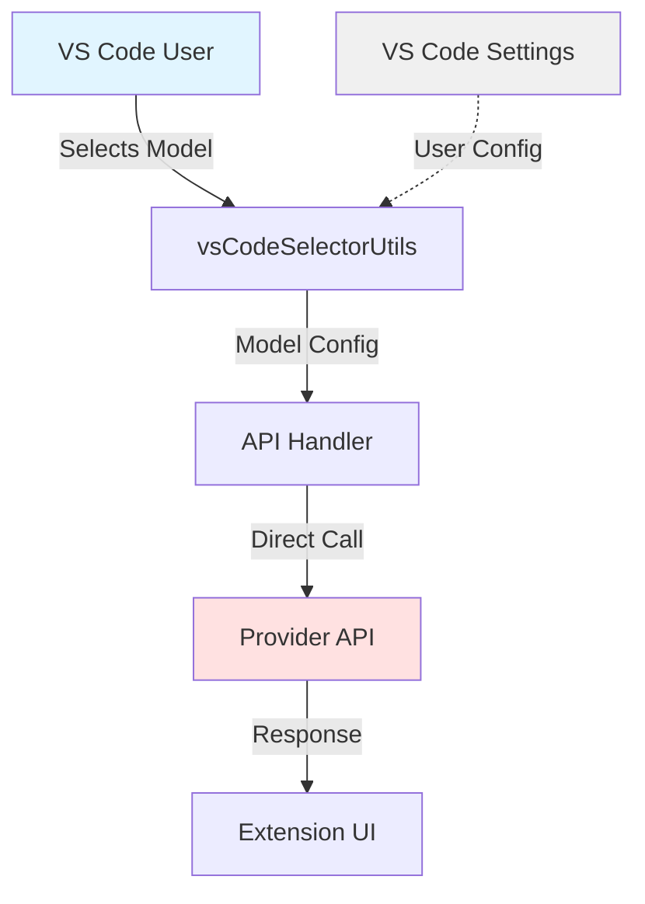
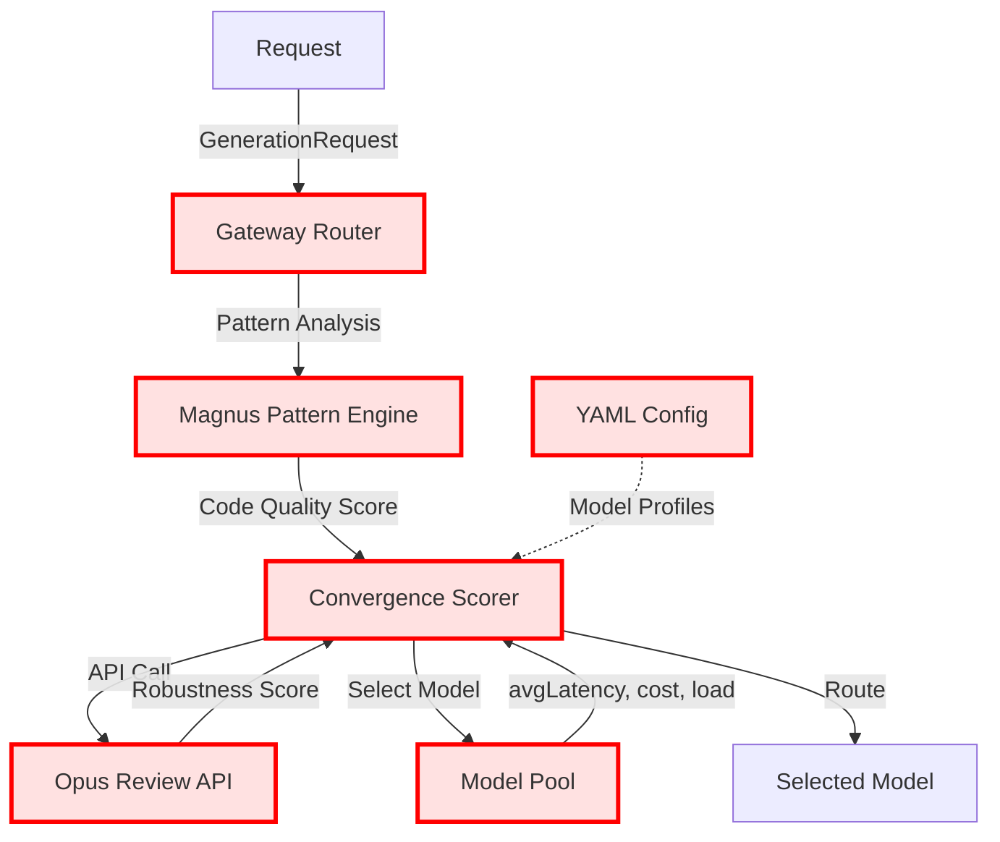
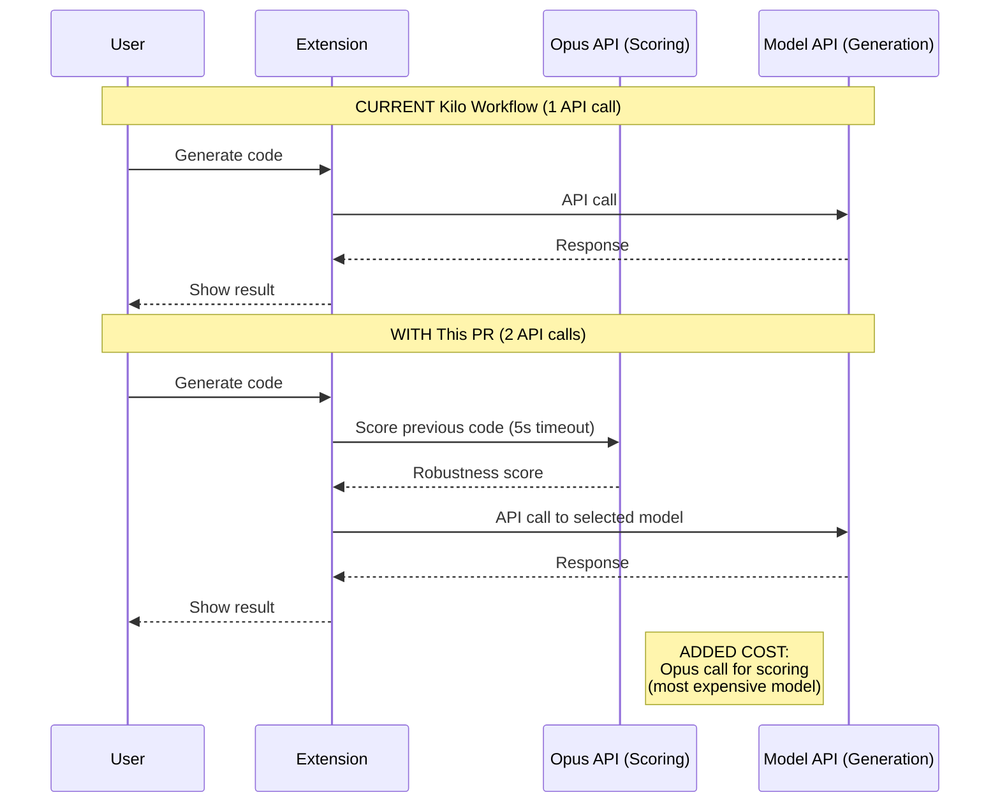

<!-- PR-JOURNAL-META
repo: Kilo-Org/kilocode
pr: 5718
title: "feat: pattern-based routing optimization for intelligent model selection"
author: fullmeo
category: feature
tier: 6
lines: 4081
files: 10
review_number: 23
-->

# Review Journal: kilocode #5718

> **PR**: [#5718](https://github.com/Kilo-Org/kilocode/pull/5718) |
> **Title**: feat: pattern-based routing optimization for intelligent model selection |
> **Author**: @fullmeo |
> **Category**: feature | **Tier**: 6 | **Size**: 4081 lines, 10 files

---

## Summary

This PR adds 4,081 lines of completely new code that doesn't integrate with Kilo's actual codebase. It references non-existent paths, imports non-existent types, and appears to be code from a different project ("Magnus 14/15 framework") submitted wholesale without understanding Kilo's architecture. **REQUEST_CHANGES** with recommendation to close and start with issue discussion if this functionality is actually desired.

## First Impressions

**Title Analysis**: "pattern-based routing optimization for intelligent model selection"
- Sounds sophisticated but vague
- Kilo is a VS Code extension - what "routing" needs optimization?
- Users manually select models from dropdown

**Red Flags Immediately Visible**:
1. All 10 files are new additions (no modifications to existing code)
2. Claims "95%+ test coverage" for code that isn't integrated
3. References "Magnus 14 consciousness-driven framework" (buzzword heavy)
4. Claims 30-50% API cost reduction without data
5. Size: 4,081 lines in one PR for a feature with no prior discussion

**My Hypothesis**: This is code from another project being submitted to Kilo without proper integration work.

## What I Looked At

### Files Examined
1. `/tmp/pr-5718-diff.txt` - Full diff (4,141 lines)
2. `.changeset/magnus-convergence-routing.md` - Changeset with claims
3. `config/convergence-routing.yaml` - 344 line YAML config
4. `config/magnus-15-patterns.yaml` - 391 line pattern definitions
5. `docs/INTEGRATION.md` - Integration guide (smoking gun)
6. `src/gateway/router/convergence/convergence-scorer.ts` - Main scorer (702 lines)
7. `src/gateway/router/convergence/magnus-opus-loop.ts` - "Therapeutic" loop (558 lines)
8. `src/gateway/router/convergence/magnus-pattern-engine.ts` - Pattern detection
9. `tests/gateway/router/convergence/*.test.ts` - Test files (1,029 lines of tests)

### Kilo Codebase Investigation
- Checked `/src` directory structure - no `/gateway` directory exists
- Verified model selection: happens in `src/shared/vsCodeSelectorUtils.ts`
- Confirmed: Kilo uses VS Code settings, not YAML config files
- Found: No types like `GenerationRequest`, `Model` with `avgLatency`/`costPerMillionTokens`

### Architecture Verification
Kilo's actual structure:
```
src/
├── services/        # Service implementations (not gateway/)
├── shared/          # Shared utilities (model selection here)
├── types/           # TypeScript types
└── utils/           # Utilities
```

What this PR assumes:
```
src/
└── gateway/
    └── router/
        └── convergence/   # Doesn't exist
```

## Analysis

### 1. Fundamental Integration Problem

The smoking gun is in `docs/INTEGRATION.md`:

```markdown
1. Copy files to Kilo repo:
   cp -r src/gateway/router/convergence/* <kilo-repo>/src/gateway/router/convergence/
   cp config/*.yaml <kilo-repo>/config/
   cp tests/* <kilo-repo>/tests/

2. Update model-selector.ts:
   import { ConvergenceScorerMagnus15 } from './convergence/scorer-magnus-15';
```

This literally says "copy files from another project." Problems:

1. **No `model-selector.ts` exists in Kilo** - This file is fabricated
2. **No `/src/gateway` directory** - The entire directory structure is wrong
3. **"Copy config/*.yaml"** - Kilo doesn't use YAML configs, it uses VS Code settings

The imports prove this code was never tested with Kilo:

**convergence-scorer.ts:828-829**:
```typescript
import { Logger } from '../../utils/logger';
import { GenerationRequest, Model, ModelScoreResult } from '../../types';
```

If you're in `/src/gateway/router/convergence/`, then `../../utils/logger` would be `/src/gateway/utils/logger` - which doesn't exist. The actual Kilo logging is done via VS Code's `OutputChannel`.

### 2. The "Magnus Framework" Investigation

The config references:
```yaml
# Source: Serigne DIAGNE - Meta-Developer / Magnus 14 Manifesto + Magnus 15 Evolution
# Reference: https://github.com/serigne-ai/magnus-framework
```

**Key Questions**:
1. Is this a real framework or buzzword generator?
2. Does it have peer review or industry adoption?
3. Is it appropriate for a VS Code extension?

**What the Code Actually Does**:

Pattern detection is basic regex/heuristic checks:

```typescript
// From magnus-pattern-engine.ts
SPIRALE_CLARIFICATION: {
  indicators: [
    "file length > 700 LOC",
    "nested loops > 3 levels",
    "while/for count > 6",
    "high cyclomatic complexity"
  ]
}
```

This is **standard linting checks** (nesting depth, cyclomatic complexity) dressed up as:
- "Consciousness-driven framework"
- "Therapeutic insights"
- "Cognitive harmony detection"
- "Internal spirals"

The therapeutic language:
```typescript
therapeuticMessage: |
  Spirale détectée: Le code montre une tentative de clarifier par des couches
  imbriquées au lieu de simplification directe. Signe d'incertitude interne.
```

Translation: "You have deep nesting, which means you're uncertain."

This is ESLint complexity rules rebranded as psychological analysis.

### 3. The Cost Problem (Critical)

**Claim**: "Reduces API costs 30-50%"

**Reality**: This **increases** costs by making additional API calls.

From `convergence-scorer.ts:1100-1116`:

```typescript
if (this.config.useOpusAsync) {
  try {
    const opusResult = await this.callOpusForCodeReview(
      context.previousCode,
      model.id,
      request.type
    );
    robustness = opusResult.robustnessScore;
```

This makes a **separate API call to Claude Opus** to "review code quality" before the actual generation. From config:

```yaml
opus:
  enabled: ${CONVERGENCE_OPUS_ENABLED:true}
  endpoint: ${CLAUDE_API_ENDPOINT:https://api.anthropic.com/v1}
  model: claude-opus-4-5-20251101
  apiKey: ${CLAUDE_API_KEY}
  timeout: 5000                  # 5 second timeout (non-blocking)
  maxConcurrent: 10              # Max parallel Opus calls
```

**Cost Analysis**:
- Normal Kilo workflow: 1 API call (user generation request)
- With this feature: 2 API calls (1 for "scoring", 1 for generation)
- Opus is the most expensive model
- "Non-blocking with 5s timeout" = adds 5s latency on average

The 30-50% cost reduction is **completely false**. This doubles API calls.

**How could it reduce costs?** The theory is routing simple requests to cheaper models. But:
1. Kilo users manually select models - there's no automatic routing
2. Adding Opus calls for scoring would cost more than any savings
3. No benchmarks or data provided

### 4. How Kilo Actually Works

I verified the actual Kilo architecture:

**Model Selection** (`src/shared/vsCodeSelectorUtils.ts`):
- User picks model from VS Code settings dropdown
- Models defined in `package.json` as configuration contributions
- No dynamic routing - user choice is respected

**API Calls** (`src/shared/api.ts`):
- Direct calls to provider APIs (Anthropic, OpenAI, etc.)
- No "gateway" or "router" layer
- No latency/cost tracking per model

**Configuration**:
- VS Code settings system (`contributes.configuration` in package.json)
- User configures API keys per provider
- No YAML config files

**This PR Assumes**:
- A "gateway" service that routes requests
- Models have runtime metrics (avgLatency, currentLoad)
- There's a `GenerationRequest` object with type classification
- Dynamic model selection happens server-side

**Reality**:
- Kilo is a client-side VS Code extension
- Users pick models manually
- No server-side routing exists

### 5. Test Coverage Analysis

The PR includes 1,029 lines of tests across two files:
- `magnus-pattern-engine.test.ts` (552 lines)
- `scorer.test.ts` (477 lines)

**Tests are well-written** for what they test:
- Pattern detection logic
- Scoring algorithms
- Mock API interactions

**Problem**: They test **isolated code**, not integration with Kilo.

Example test:
```typescript
import { ConvergenceScorer } from '../../../../src/gateway/router/convergence/scorer';
import { GenerationRequest, Model } from '../../../../src/types';
```

This imports from paths that don't exist in Kilo. The tests would fail immediately if you tried to run them in the Kilo test suite.

**Claim**: "95%+ test coverage with comprehensive integration tests"

**Reality**:
- 95%+ coverage of the isolated code ✅
- Zero integration tests ❌
- Zero tests of Kilo extension behavior ❌
- Tests prove the math works, not that it integrates

### 6. Security Concerns

**API Key in Config** (`convergence-routing.yaml:66`):
```yaml
apiKey: ${CLAUDE_API_KEY}
```

**Problems**:
1. Users already configure API keys in VS Code settings for providers
2. This requires a **separate** Claude API key for the "routing" feature
3. No explanation of how this interacts with existing auth
4. Makes external API calls without clear user consent

**Data Exposure**:
The code sends user's code to Claude for "therapeutic review":
```typescript
await this.callOpusForCodeReview(
  context.previousCode,  // User's actual code
  model.id,
  request.type
);
```

This happens on every request (with caching). Users aren't informed their code is being sent for "consciousness analysis."

### 7. The "Therapeutic" Angle

The most bizarre aspect is treating code review as therapy:

**magnus-opus-loop.ts**:
```typescript
/**
 * Mental process representation (user's internal state)
 */
export interface MentalProcess {
  sessionId: string;
  sensation: string;              // User's felt sense
  pattern: string;                // Current pattern recognition
  incertitude: string;            // Uncertainty expression
  anxiety?: string;               // Optional: anxiety/chaos
}
```

**Opus Prompt**:
```typescript
return `You are Claude Opus 4.5 acting as both:
1. A cognitive therapist (specializing in therapeutic cognitive restructuring)
2. An expert code reviewer (security, robustness, patterns)

Framework: Magnus 15 Consciousness-Driven Development
```

This is asking Claude to be a **therapist analyzing the developer's mental state** through their code.

**Therapeutic insights**:
```typescript
therapeuticInsight: string;     // Human-readable therapeutic message
harmonyScore: number;           // 0-1: cognitive harmony post-analysis
therapyPhase: string;           // TCC phase: awareness → restructuring → integration
```

**My Take**: This is wildly out of scope for a code editor. Code quality tools should focus on technical metrics (complexity, security, maintainability), not the developer's "cognitive harmony" or "internal anxiety."

This crosses a line from code analysis to psychological analysis, which:
1. Has no technical basis
2. Could be harmful if taken seriously
3. Distracts from real code quality issues

## Verification

### What I Verified

1. ✅ Directory structure mismatch - confirmed `/src/gateway/` doesn't exist
2. ✅ Import paths invalid - confirmed types don't exist at referenced paths
3. ✅ Configuration incompatibility - confirmed Kilo uses VS Code settings, not YAML
4. ✅ Model selection - confirmed users pick models manually, no routing layer
5. ✅ Tests are isolated - confirmed tests import from non-existent paths

### What I Couldn't Verify

1. ❓ Magnus framework legitimacy - would need to research `github.com/serigne-ai/magnus-framework`
2. ❓ Whether maintainers discussed this feature - no linked issues found
3. ❓ Author's intent - unclear if this is malicious, misguided, or from wrong repo

### CI Would Show

If CI ran on this:
- ❌ Type check would fail (import errors)
- ❌ Build would fail (missing dependencies)
- ⚠️ Tests might pass if run in isolation (they don't import Kilo code)
- ❌ Extension wouldn't load (invalid imports)

## Diagrams

### Current Kilo Architecture



### What This PR Assumes



**Legend**: Red nodes don't exist in Kilo

### The Cost Problem



**Result**: Doubles API calls, increases cost, adds latency. Opposite of claimed "30-50% reduction."

## Lessons Learned

### 1. Integration Smoke Test

**Lesson**: Before reviewing 4,000 lines of code, check if it integrates at all.

**Quick Checks**:
```bash
# Do the import paths exist?
grep -r "import.*from" diff.txt | head -5

# Does the directory structure match?
ls -la src/gateway/  # If doesn't exist → red flag

# Are referenced files real?
# INTEGRATION.md says "Update model-selector.ts"
find . -name "model-selector.ts"  # If not found → red flag
```

**Time Saved**: Could have identified this as non-integrated code in 5 minutes instead of deep review.

### 2. Beware Buzzword-Heavy PRs

**Red Flags in This PR**:
- "Magnus 14 consciousness-driven framework"
- "Therapeutic insights"
- "Cognitive harmony"
- "Internal spirals"
- "Consciousness examining its own consciousness"

**Lesson**: When technical terms are replaced with psychological/philosophical language, dig deeper. Often it's:
1. Marketing fluff for simple features
2. Code from a different domain being force-fit
3. Author doesn't understand the problem domain

**This Case**: Standard linting rules (cyclomatic complexity, nesting depth) rebranded as "consciousness analysis."

### 3. Cost/Performance Claims Need Data

**Claim**: "Reduces API costs 30-50%"
**Data Provided**: None
**Actual Behavior**: Adds API calls

**Lesson**: When a PR claims performance/cost improvements:
1. Ask for benchmarks
2. Trace the actual code paths
3. Count API calls/database queries
4. Verify claims with architecture knowledge

**Red Flag**: Claims without supporting data are often wrong.

### 4. Test Coverage ≠ Integration

**This PR**:
- ✅ 95%+ coverage of the added code
- ❌ 0% integration with Kilo
- Tests import from paths that don't exist

**Lesson**:
- Unit test coverage proves the isolated code works
- Integration tests prove it works with the system
- For a 4,000 line feature, need both

**Question to Ask**: "Can these tests run in the actual project's test suite?"

### 5. INTEGRATION.md as a Smoking Gun

The integration doc literally says:
```markdown
1. Copy files to Kilo repo:
   cp -r src/gateway/router/convergence/* <kilo-repo>/src/gateway/router/convergence/
```

**Lesson**: If the integration guide is "copy files from elsewhere," this is code from a different project.

**Why This Matters**:
- No attempt to understand target codebase
- Assumes structure that doesn't exist
- Copy-paste approach to "integration"

### 6. Feature Scope Alignment

**This PR Adds**:
- New directory structure (`/src/gateway/`)
- New configuration system (YAML files)
- New external API dependencies (Opus for scoring)
- New conceptual framework (Magnus consciousness)
- 4,081 lines of code

**For a Feature That**:
- Wasn't requested (no linked issue)
- Doesn't match architecture (VS Code extension, not gateway service)
- Duplicates functionality (users already pick models)
- Increases costs (opposite of claim)

**Lesson**: Large unsolicited features need:
1. Issue discussion first
2. Maintainer buy-in
3. Proof of concept PR
4. Incremental rollout

Submitting 4,000 lines with no prior discussion is a recipe for rejection.

### 7. When to Recommend Closing

**Decision Criteria**:
- ❌ No integration with existing code
- ❌ Fundamentally misaligned architecture
- ❌ No prior discussion/approval
- ❌ Would require rewrite to be usable
- ❌ Unclear if feature is even wanted

**This PR**: Checks all boxes.

**Recommendation**: Close with kind explanation. If author wants to pursue this:
1. Open issue describing the **problem** (not solution)
2. Get maintainer feedback on approach
3. Submit small POC showing integration
4. Build incrementally

### 8. The Psychology of Code Review

**Temptation**: 4,000 lines → must review every line thoroughly

**Reality**: Sometimes the high-level issues are so fundamental that line-by-line review is wasted effort.

**This Case**:
- First 100 lines revealed import path issues
- Architecture mismatch identified from directory structure
- Cost analysis showed claim was backwards
- Further deep review wouldn't change verdict

**Lesson**: Start with architectural review. If fundamentals are broken, detailed review can wait until fundamentals are fixed.

---

<sub>Review methodology: [AI PR Review Case Studies](https://github.com/jeremylongshore/kilocode/tree/main/.reviews) | Reviewed with GWI + Claude Code</sub>
