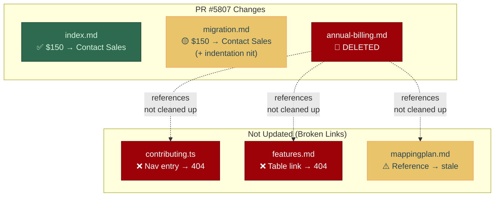

<!-- PR-JOURNAL-META
repo: Kilo-Org/kilocode
pr: 5807
title: "docs: remove Enterprise pricing, direct users to contact sales"
author: app/kiloconnect
category: docs
tier: 1
lines: 71
files: 3
review_number: 3
fork_pr: https://github.com/jeremylongshore/kilocode/pull/6
-->

# Review Journal: kilocode #5807

> **PR**: [#5807](https://github.com/Kilo-Org/kilocode/pull/5807) |
> **Title**: docs: remove Enterprise pricing, direct users to contact sales |
> **Author**: @kiloconnect (bot) / @alexkgold |
> **Category**: docs | **Tier**: 1 | **Size**: 71 lines, 3 files | **Confidence**: 5/5
>
> **Multi-AI analysis**: [Fork PR #6](https://github.com/jeremylongshore/kilocode/pull/6) — CodeRabbit, Gemini, CodeQL, Qodo

---

## Summary

This PR replaces Enterprise pricing ($150/user/month) with "Contact Sales" links across 2 docs pages and deletes an internal architecture spec (`annual-billing.md`) that contained sensitive pricing formulas and infrastructure details. The text replacements are correct, but the file deletion leaves 3 dangling references — a nav entry and a doc link that will produce broken links in the published docs.

## First Impressions

Generated by kiloconnect bot from a Slack thread with Alex Gold. The `docs:` prefix and "remove pricing" verb suggest a simple content update. At 71 lines total (67 from the deleted file + 4 changed lines), the blast radius seemed contained to 3 files.

What I expected: simple text find-and-replace across pricing pages.
What I found: that plus a file deletion that wasn't fully cleaned up.

## What I Looked At

1. **The PR diff** — 3 files: `index.md` (1 line change), `migration.md` (1 line change), `annual-billing.md` (67 lines deleted)
2. **Deleted file content** — Internal architecture spec with engineering scope, Stripe integration details, migration plans, pricing formulas ($3588/ent seat), SSO cost ($125/mo per org)
3. **Cross-references** — Searched codebase for `annual-billing` references using GitHub code search
4. **CI status** — All 12 checks pass
5. **Fork PR #6** — Bot reviews from Gemini (CodeRabbit rate-limited during analysis)

## Analysis

### The pricing text changes are clean

Two files get simple replacements:

**index.md**: `$150/user/month` → `[Contact Sales](https://kilo.ai/contact-sales)` — Clean, preserves the feature list after the price.

**migration.md**: Same pattern, but also fixes "$15/month" → "$15/user/month" (adding the missing "/user" qualifier). Bonus accuracy fix. However, an extra leading space was introduced on the `2.` list item.

### The file deletion leaves broken links

`annual-billing.md` was an internal architecture document published under `/contributing/architecture/`. Deleting it removes sensitive pricing details from public docs — good. But three files still reference it:

| File | Reference Type | Impact |
|------|---------------|--------|
| `lib/nav/contributing.ts` | Sidebar nav entry | **Broken nav link** in docs site |
| `pages/contributing/architecture/features.md` | Table row with link | **Broken doc link** |
| `mappingplan.md` | Mapping plan reference | Low (internal planning) |

The Markdoc build passes because it doesn't validate link targets at build time. These broken links would only be caught by a link checker or manual navigation.

### The deleted file was sensitive

The deleted `annual-billing.md` contained:
- Enterprise seat pricing formulas ($3588/year)
- SSO cost per org ($125/month)
- Stripe integration details
- Database schema plans (column names, migration strategy)
- Internal non-requirements and engineering scope

This content shouldn't be in public docs. The deletion is correct — but ideally the cleanup references should be in the same PR.

## Verification

All CI checks pass:

```
Build Markdoc Site     PASS    (directly relevant - docs build)
check-translations     PASS    (directly relevant - no broken strings)
compile                PASS
test-extension         PASS    (ubuntu + windows)
test-webview           PASS    (ubuntu + windows)
unit-test              PASS
build-cli              PASS
test-cli               PASS
test-jetbrains         PASS
Vercel                 SKIP    (auth required for external contributors)
```

**Note**: Build passes despite dangling references — Markdoc build validates syntax, not link integrity.

## Diagrams



## Bot Review Synthesis

| Bot | Verdict | Key Finding | Useful? |
|-----|---------|-------------|---------|
| Gemini | Comment | Caught indentation nit (` 2.` → `2.`) | Yes — same as manual finding |
| CodeRabbit | Rate-limited | Did not complete review | Needs retry |
| Greptile | No response | Did not comment | Needs investigation |
| CodeQL | N/A | No security findings (docs-only) | Expected |
| Qodo | Failed | "Failed to generate code suggestions" | Config issue persists |

**Critical observation**: Neither Gemini nor any bot caught the dangling reference issue. The broken links in `contributing.ts` and `features.md` were found only through manual codebase search. This demonstrates a key limitation of diff-only review: **bots only see what changed, not what should have changed.** Cross-reference validation requires searching beyond the diff.

## Lessons Learned

**1. File deletions need cross-reference checks.** When a PR deletes a file, always search the codebase for references to that file. Navigation configs, feature tables, and mapping docs can all break silently. This is a tier-1 check that should be in the review checklist.

**2. Bots can't catch missing changes.** AI reviewers analyze the diff. They don't ask "what else should have been in this PR?" Cross-reference validation — searching for imports, links, nav entries that point to deleted files — requires manual or Sourcegraph-style analysis.

**3. Build passing ≠ links valid.** The Markdoc site builds successfully even with broken internal links. This is a gap that a link-checking CI step would catch. Consider recommending a link checker for the docs build.

**4. Bot-generated PRs may have gaps.** This PR was built by kiloconnect from a Slack conversation. The bot correctly identified the pricing text to replace but didn't discover the nav and feature table references to the deleted file. Human + AI review catches what automated PR generation misses.

**5. Sensitive content in public docs.** The deleted `annual-billing.md` contained internal pricing formulas, SSO costs, and Stripe details. While the file was under `/contributing/architecture/` (suggesting internal use), it was published to the public docs site. The deletion is correct — but the content is already in git history.

---

<sub>Review #3 of 75 | Review methodology: [AI PR Review Case Studies](https://github.com/jeremylongshore/kilocode/tree/main/.reviews) | Reviewed with GWI + Claude Code</sub>
