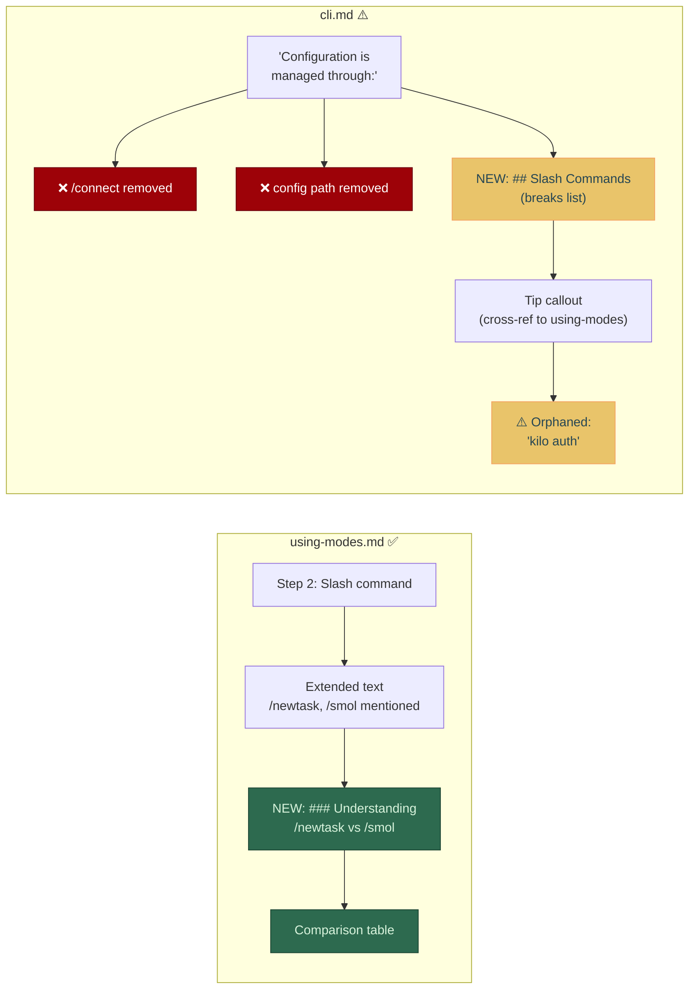

<!-- PR-JOURNAL-META
repo: Kilo-Org/kilocode
pr: 5869
title: "docs: clarify slash commands (/newtask vs /smol) (#2160)"
author: EloiRamos
category: docs
tier: 1
lines: 20
files: 2
review_number: 2
fork_pr: https://github.com/jeremylongshore/kilocode/pull/5
-->

# Review Journal: kilocode #5869

> **PR**: [#5869](https://github.com/Kilo-Org/kilocode/pull/5869) |
> **Title**: docs: clarify slash commands (/newtask vs /smol) (#2160) |
> **Author**: @EloiRamos |
> **Category**: docs | **Tier**: 1 | **Size**: 20 lines, 2 files | **Confidence**: 4/5
>
> **Multi-AI analysis**: [Fork PR #5](https://github.com/jeremylongshore/kilocode/pull/5) — CodeRabbit, Gemini, CodeQL, Qodo

---

## Summary

This PR addresses issue [#2160](https://github.com/Kilo-Org/kilocode/issues/2160) by clarifying the difference between `/newtask` and `/smol` slash commands. The `using-modes.md` change is clean — a well-structured comparison table that matches the source code. The `cli.md` change has a structural problem: it breaks an existing configuration list by inserting a new section mid-list, removing two items and orphaning a third. Both AI reviewers independently flagged the same issue.

## First Impressions

A `docs:` prefix with two files suggests a cross-cutting documentation improvement. The linked issue (#2160) is a reasonable user confusion point — `/newtask` and `/smol` sound similar but serve different purposes. Expected a straightforward clarification; found one clean change and one that needs structural revision.

## What I Looked At

1. **The PR diff** — 2 files: `using-modes.md` (+9 lines, clean) and `cli.md` (+5/-2, structural issue)
2. **Issue [#2160](https://github.com/Kilo-Org/kilocode/issues/2160)** — User request to clarify command differences
3. **Source code** — `webview-ui/src/utils/slash-commands.ts:22-34` to verify command descriptions
4. **Fork PR #5** — Bot reviews from CodeRabbit and Gemini
5. **All upstream CI checks** — 12/12 pass (Vercel skipped, expected)

## Analysis

### using-modes.md — Clean

The change extends step 2 in the "Four ways to switch modes" list and adds a subsection with a comparison table:

| Command | Purpose | When to Use |
|---------|---------|-------------|
| `/newtask` | Creates a new task with context from the current task | Starting something new while carrying over context |
| `/smol` | Condenses your current context window | Conversation too long, want to summarize |

I verified these descriptions against the source code:
```typescript
// webview-ui/src/utils/slash-commands.ts
{ name: "newtask", description: "Create a new task with context from the current task" },
{ name: "smol", description: "Condenses your current context window" },
```

Accurate match. The `### Understanding /newtask vs /smol` heading also creates a clean anchor for the cross-reference in the cli.md callout.

### cli.md — Structural Break

The new `## Slash Commands` section is inserted between line 165 ("Configuration is managed through:") and the configuration list items. This creates three problems:

1. **Removed content**: The `/connect` command reference and config file path (`~/.config/kilo/config.json`) are deleted
2. **Orphaned bullet**: `kilo auth` now sits alone after a callout block, disconnected from its parent list
3. **Broken grammar**: "Configuration is managed through:" introduces nothing

The intent is good — adding a cross-reference to the using-modes.md explanation. But the execution needs restructuring: keep the configuration list intact and place the Slash Commands section in its own location.

## Verification

All relevant CI checks pass:

```
Build Markdoc Site     PASS    (directly relevant - docs build)
check-translations     PASS    (directly relevant - no broken strings)
compile                PASS
test-extension         PASS    (ubuntu + windows)
test-webview           PASS    (ubuntu + windows)
unit-test              PASS
build-cli              PASS
test-cli               PASS
test-jetbrains         PASS
Vercel                 SKIP    (auth required for external contributors)
```

## Diagrams



## Bot Review Synthesis

| Bot | Verdict | Key Finding | Useful? |
|-----|---------|-------------|---------|
| CodeRabbit | Comment | Flagged orphaned `kilo auth` bullet and structural break | Yes — same finding as manual review |
| Gemini | Comment | Flagged both cli.md structure break AND using-modes.md list nesting | Yes — caught both files, one was a false positive |
| Greptile | No response | Did not comment on this PR | Needs investigation |
| CodeQL | N/A | No security findings (docs-only) | Expected |
| Qodo | Failed | "Failed to generate code suggestions" | Config issue persists |

**Bot consensus**: CodeRabbit and Gemini both independently identified the cli.md structural issue. Gemini also flagged the `### Understanding /newtask vs /smol` header inside a numbered list in using-modes.md as potentially breaking list continuity — this is a valid concern with strict Markdown parsers, though Markdoc may handle it fine. Two-bot consensus on the main finding increases confidence.

## Lessons Learned

**1. Cross-cutting docs changes need structural awareness.** When adding content to existing documentation, check that you're not splitting an in-progress syntactic structure (list, table, code block). The cli.md change is a classic "insert in the wrong spot" issue.

**2. Bot agreement strengthens review confidence.** When two independent AI reviewers flag the same issue with different framing (CodeRabbit: "orphaned bullet", Gemini: "breaks grammatical flow"), the finding is almost certainly real. This is the first review where bot consensus directly validated manual analysis.

**3. Source code verification catches docs drift.** Checking slash command descriptions against `slash-commands.ts` confirmed accuracy. As the codebase evolves, these descriptions could drift — the source code is the ground truth.

**4. All CI green doesn't mean all content is correct.** Markdoc built successfully despite the structural issue. The build validates syntax, not document coherence. Human/AI review catches what CI cannot.

---

<sub>Review #2 of 75 | Review methodology: [AI PR Review Case Studies](https://github.com/jeremylongshore/kilocode/tree/main/.reviews) | Reviewed with GWI + Claude Code</sub>
